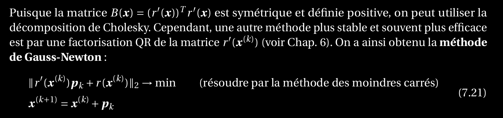

Expliquer la méthode de Gauss-Newton ainsi que son implémentation
====================================================================

On reprendre la méthode de Newton Vectorielle et à la place de faire le calcule coûteux à chaque fois, on réutilise la matrice jacobienne de inv(f) m fois avant de la changer.

