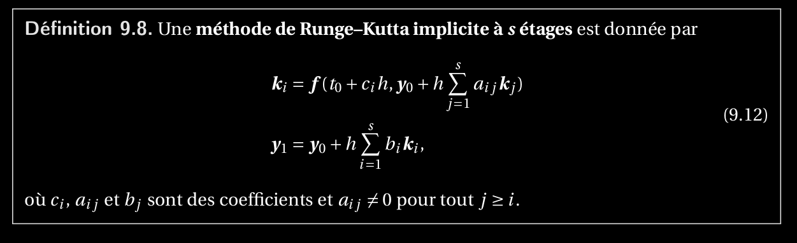

20. Expliquer les méthodes de Runge–Kutta à s étages implicites. Expliquer comment obtenir les méthodes du point milieu et du trapèze, et montrer leur ordre. Montrer que l’ordre d’une méthode de Runge–Kutta à s étages explicite ne peut pas dépasser s.
============================================================================================================================================================================================================================================================================

Point du milieux et trapèze + ordre?

ordre Runge-Kutta s étages explicite <= s étages?
