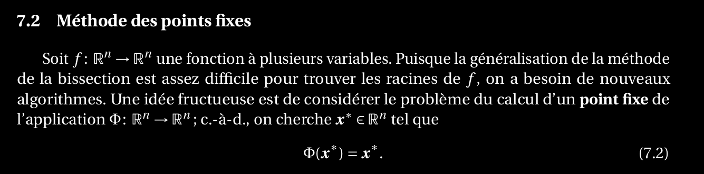

7. Expliquer comment on peut utiliser une méthode des points fixes pour résoudre des équations non-linéaires.
=================================================================================================================

Méthode:
* On cherche Teta | Teta(x)= x
* On représente Teta comme Teta(x)= x-Bf(x)
* On prend un x approximatif et on itère 

