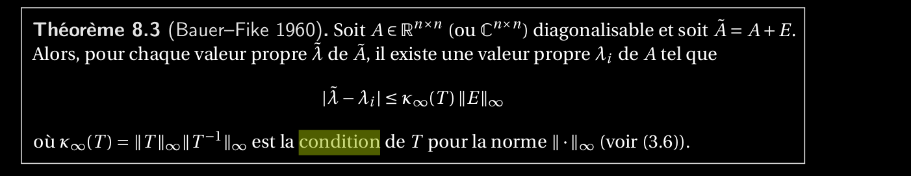
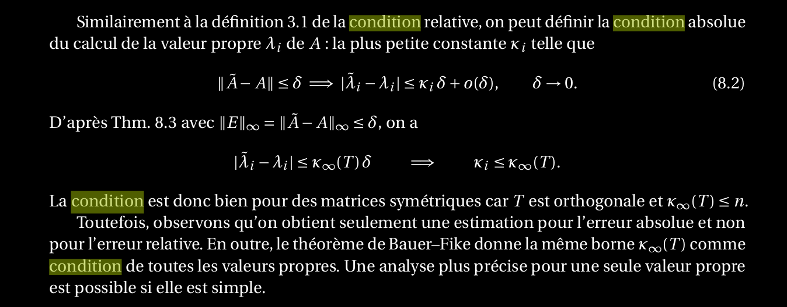

25. Définir la condition absolue κ d’une valeur propre simple. Quelle est le lien entre la condition_et la dérivée d’une valeur propre par rapport à une perturbation ? Donner des exemples d’une_valeur propre (i) bien conditionnée, (ii) mal conditionnée, (iii) non différentiable par rapport_aux petites perturbation.
==========================================================================================================================================================================================================================================================================================================================================

