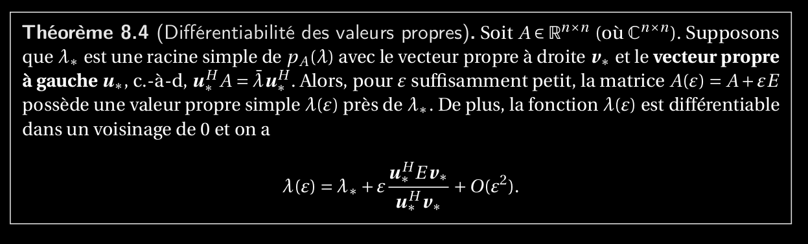

1. Expliquer le théorème sur la différentiabilité des valeurs propres simples. Donner une formule_pour la dérivée λ′ (0) de λ(ε) par rapport à la perturbation A(ε) = A + εC et expliquer son_utilité pour le calcul numérique de la valeur propre en question.

