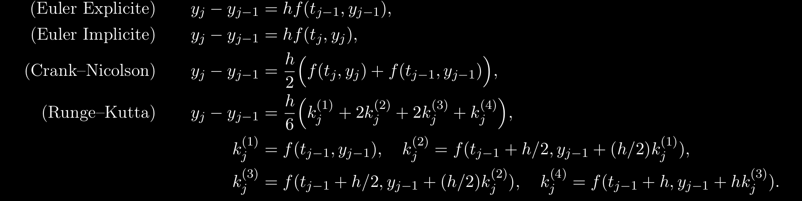
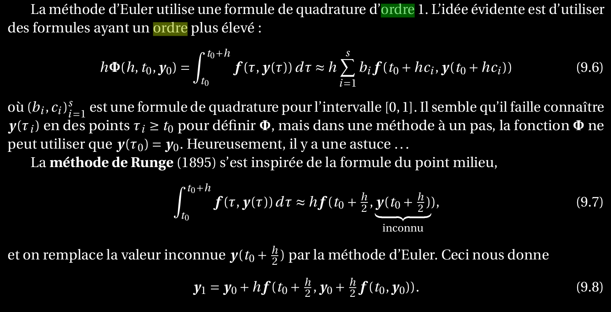
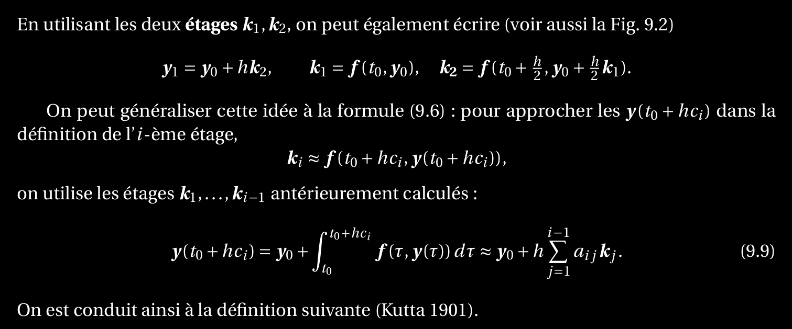

Trouver les méthodes explicites d'Euler et de Rung grâce aux formules de quadrature
=====================================================================================

La méthode d'Euler est d'ordre 1

La méthode de Rung est d'ordre 2

Pour calculer la méthode d'Euler:

Pour calculer la méthode de Rung-Kutta:

