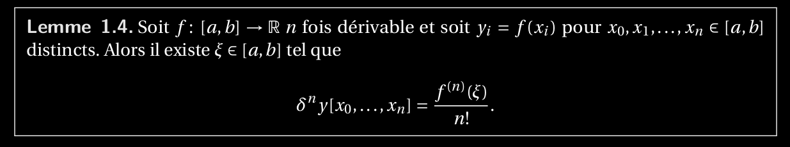
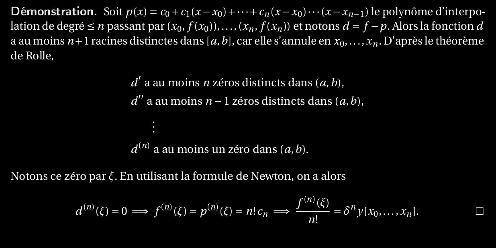

4. Enoncer et démontrer le lemme mettant en relation les dérivées et les différences divisées. En_déduire et démontrer le théorème pour estimer l’erreur de l’approximation par un polynôme_d’interpolation.

