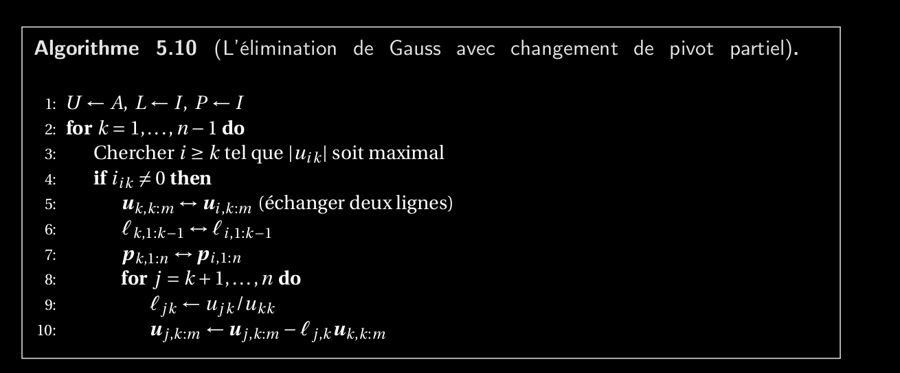
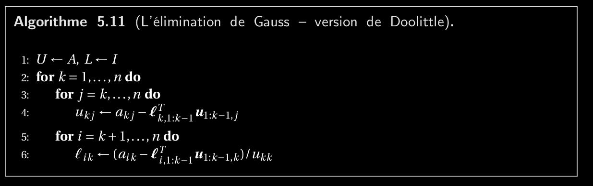
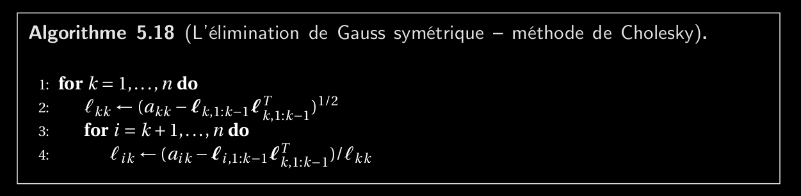
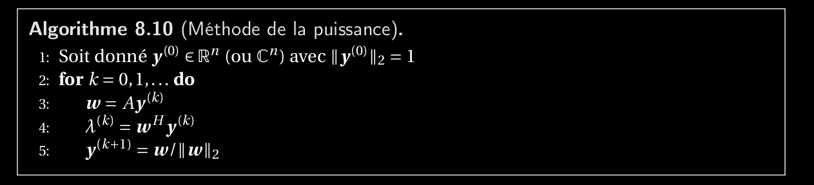
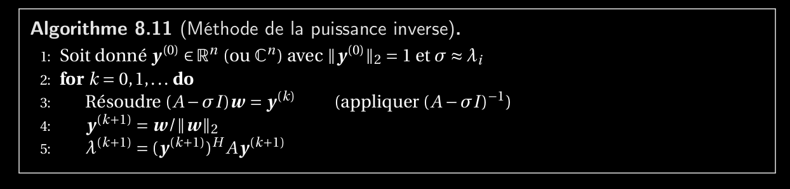
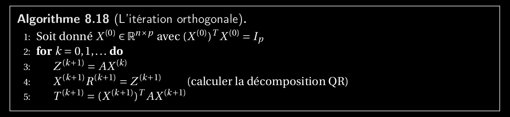

Questions Analyse Numérique
============================

[automne](automne)
[printemps](printemps)

## Rechercher
Coût polynôme de Lagrange

La démo du polynôme de Newton se fait par récurrence

