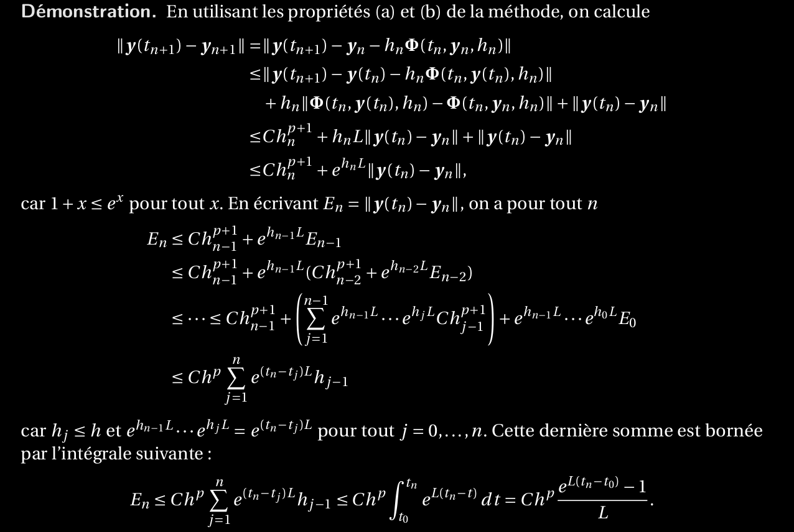
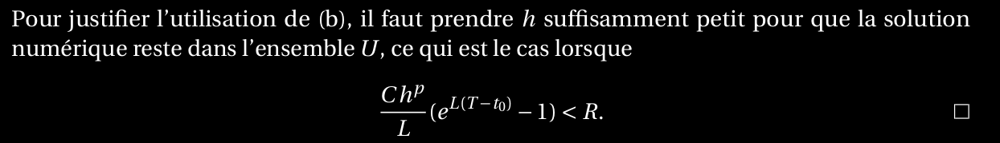

19. Expliquer l’ordre d’une méthode de Runge–Kutta à s étages. Montrer que l’erreur globale d’une méthode d’ordre p est ≤ Chp . De quoi dépend la constante C ?
==================================================================================================================================================================================

Ordre Runge-Kutta s étages

