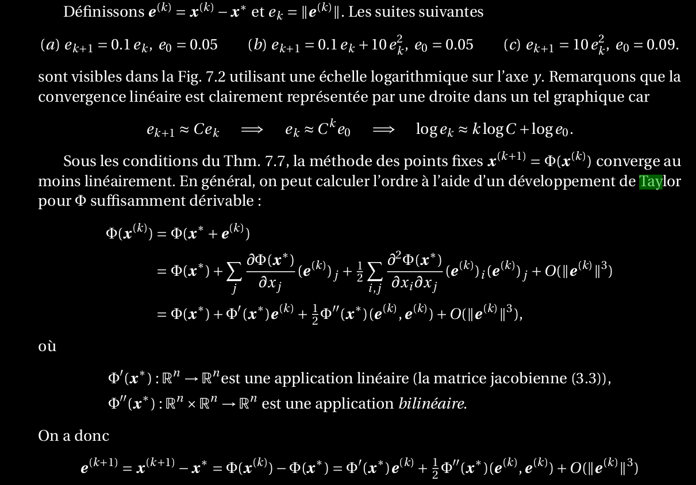
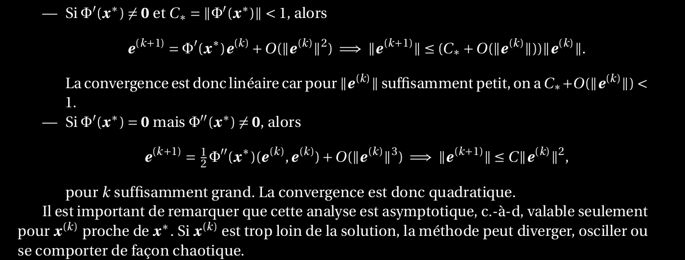

10. Comment peut-on calculer l’ordre de convergence pour une méthode des points fixes ? Expliquer à l’aide d’un développement de Taylor.
=================================================================================================================================================

En suposant que x^k -> x^* (donc que ||e||^k -> 0)

