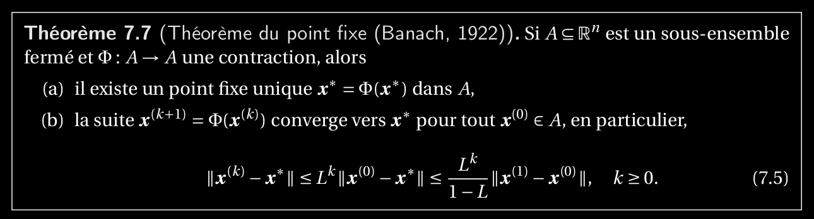

Théorème du point fixe de Banach
==================================

Si A est un sous ensemble fermé et si Teta endomorphisme est contraction alors:
	* Il existe un point fixe
	* Teta converge vers ce point fixe

Exemple de fonction qui est une contraction
