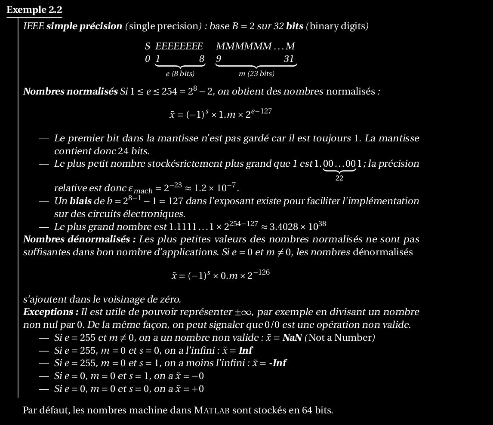
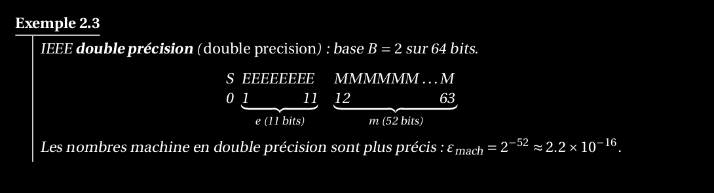

1. Détailler la représentation des nombres machine en virgule flottante (comme vue en cours)_et définir l’epsilon de la machine. Exemplifier les définitions pour les nombres machine en_double précision.

