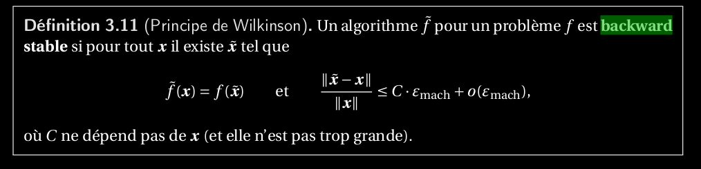
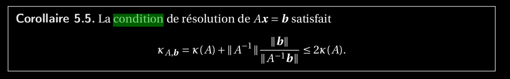

34. Enoncer et démontrer le théorème sur l’erreur backward d’un système d’équations linéaires_inversible et son résidu._([théorème_erreur_backward_linéaire_inversible](théorème_erreur_backward_linéaire_inversible))

