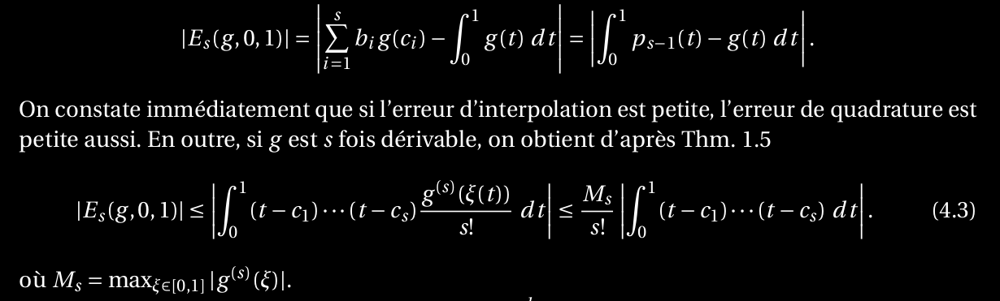
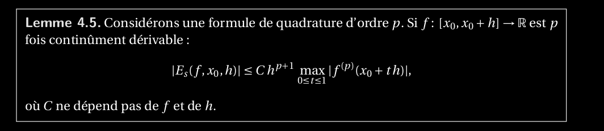
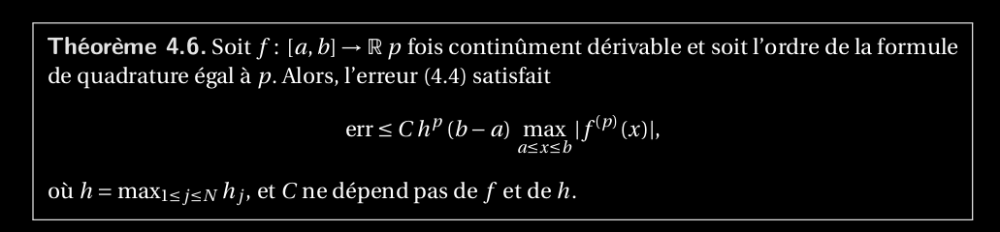
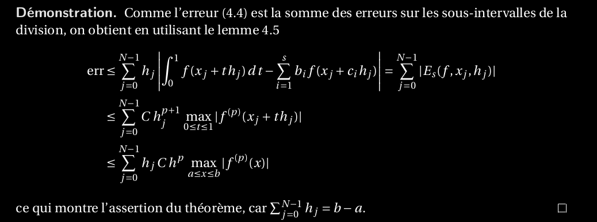

24. Si une formule de quadrature est d’ordre p, énoncer et démontrer le théorème de l’erreur_globale de la quadrature en justifiant le lemme pour l’erreur locale à l’aide des développements_de Taylor.

