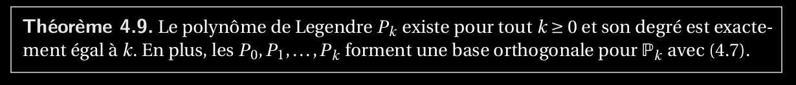
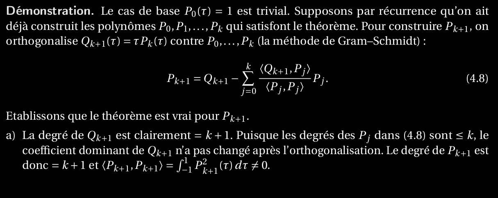
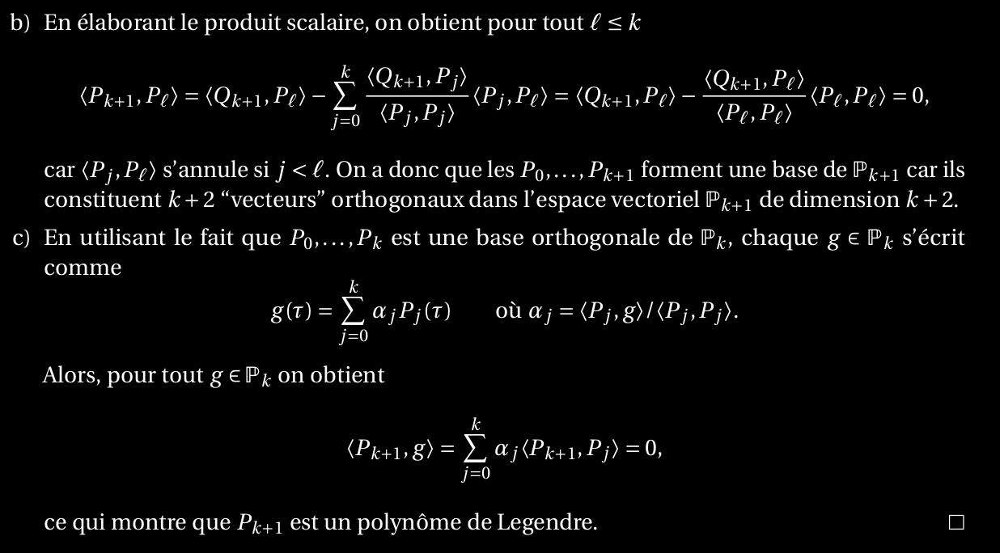

26. En utilisant le produit scalaire hp, qi des polynômes p et q, énoncer et montrer le théorème_sur l’existence des polynômes de Legendre._([théorème_polynôme_Legendre](théorème_polynôme_Legendre))

