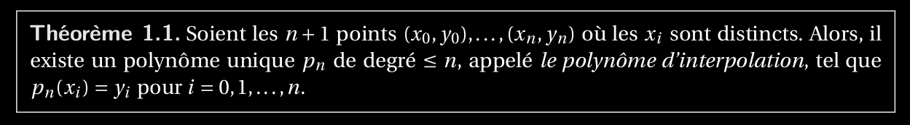

1. Enoncer et démontrer le théorème concernant l’existence et l’unicité du polynôme d’interpolation.
===============================================================================================================

