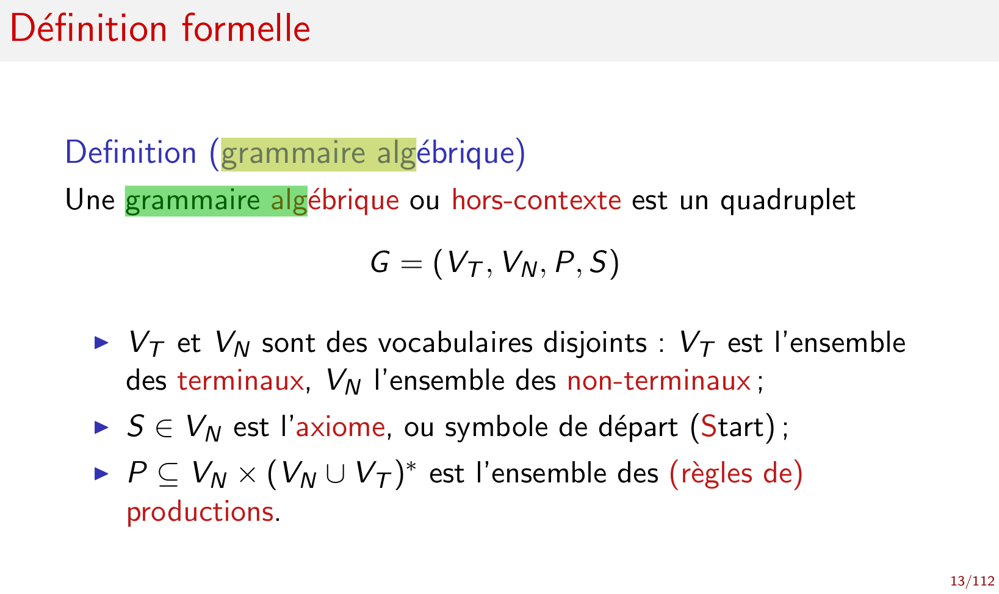

Synthaxe
========

Définit la forme des phrases

## analyse syntaxique 
Langage algébrique ou automate à pile

Reçoit de l'analyseur lexical une suite de symboles.
reconnaît dans cette suite la structure d'un texte.

On a un seul choix possible V_N à gauche et on a le droit à tout (ou a rien avec le membre de droite)

On génère des mots/phrase par la `dérivation directe` 
