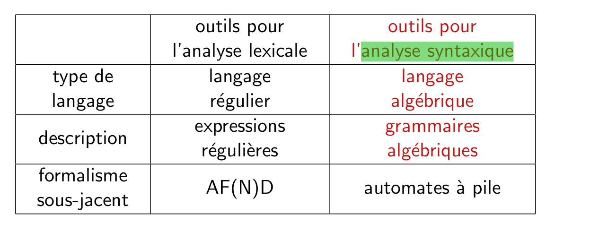
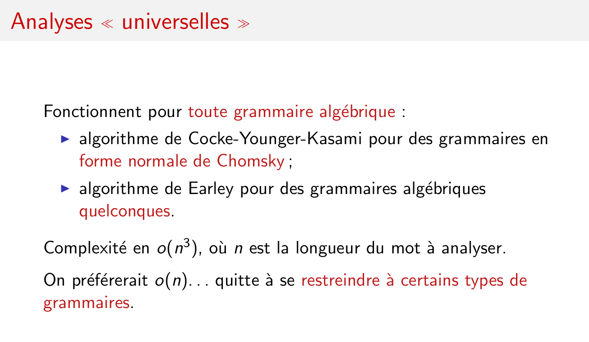
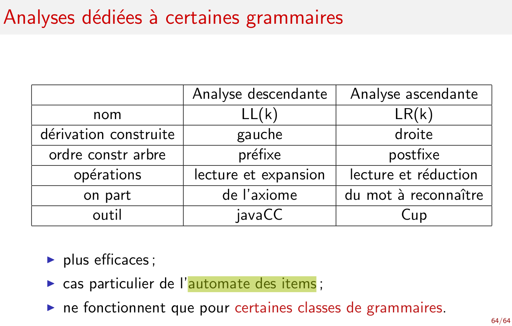

[Questions](Questions)

éléments importants
===================

## outils

<<<<<<< HEAD
## def compilation
* Analyser une description
* Synthétiser une exécution 
* Conserver la sémantique

On part d'une forme source pour arriver vers une forme objet

## def interprétation
* Expliquer et donner une sémantique
* Parcourir un graphe, noeud;instruction

=======

## objets
Arbre de dérivation
>>>>>>> e968ddfe53e220ecfc37031395c81d12591e3eaa
