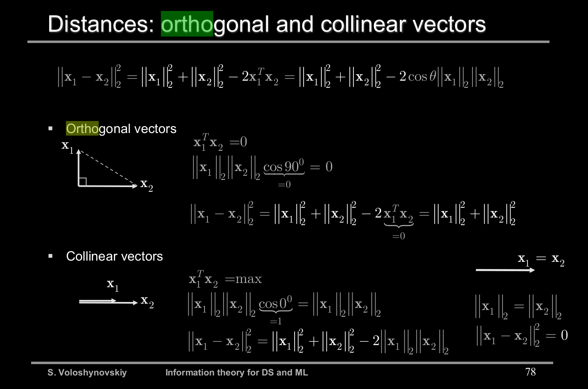
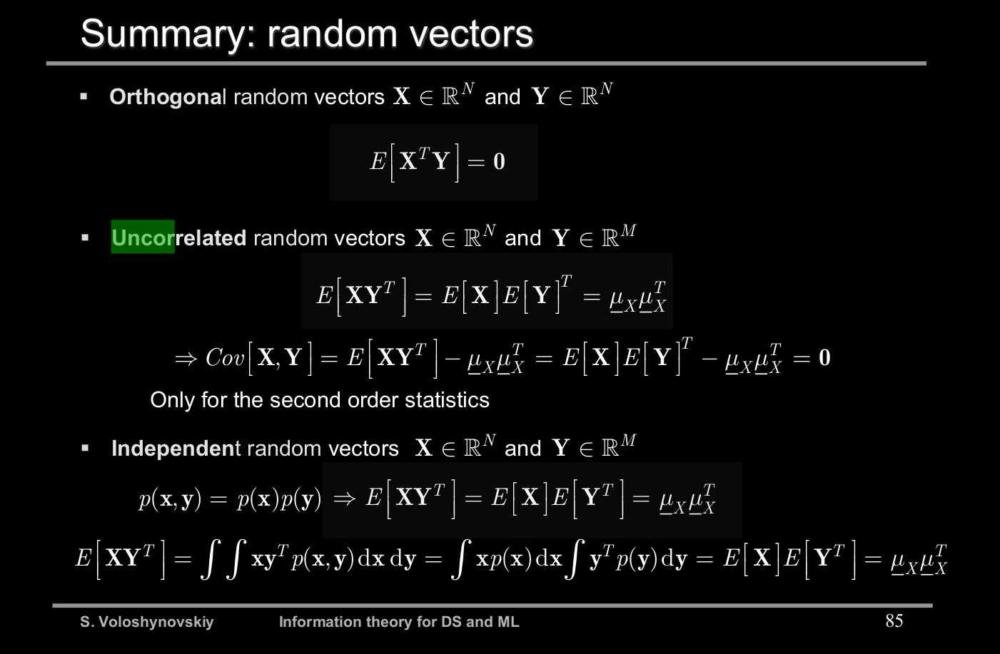

1. Explain the difference between the orthogonal, uncorrelated and independent random vectors. Explain the structure of covariance matrix. Exemplify the covariance matrix of Gaussian random vectors.

