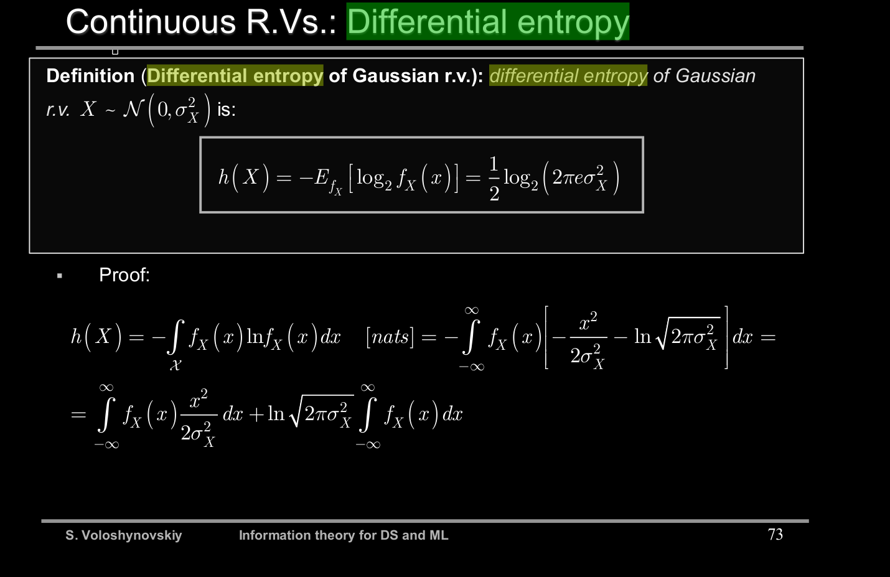

11. Differential entropy of Gaussian and uniform pdfs. Explain which distribution has maximum differential entropy and under which conditions (intuitive explanation with examples). 12. Explain why Gaussian pdf has maximum entropy among all distributions with the bounded variance (possible ways how to prove it).

