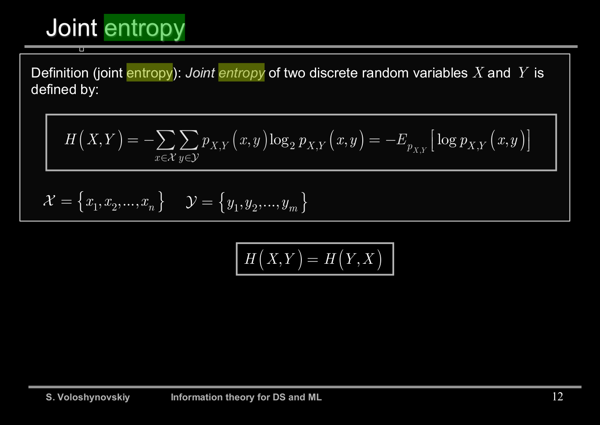
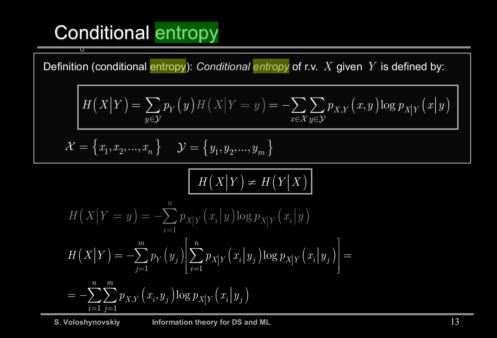

[2](2). Joint entropy and conditional entropy: definitions and properties. Explain the role of conditioning on entropy. Use the Venn diagram for your justification or any other properties such as chain rule to argument your answer.

