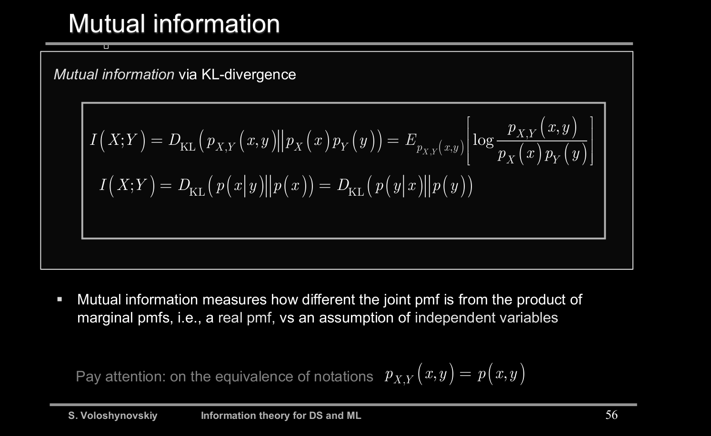

8. Mutual information for multiple random variables. Explain the chain rule decomposition of mutual information. Explain the notion of conditional mutual information. The Venn diagram interpretation.([R8](R8))

