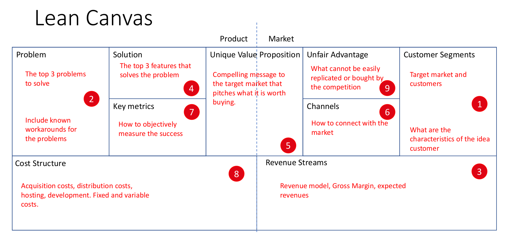

Lean Canvas
===========

Capture des besoins sans se projeter tout de suite sur la solution
On commence non pas sur le problème mais sur le marché

Segment de client primaire et secondaire en fonction de la nécessité

Être honnête 

Connaître son marché permet de mieux déterminer son moyen de communication
Le but est d'échouer vite. D'où l'importance de savoir mesurer son taux de réussite ou d'échec très rapidement.

se faire racheter
crossel

l'unfair advantage: tout attribut ou possessions qui nous donne un avantage sur la concurrence.

