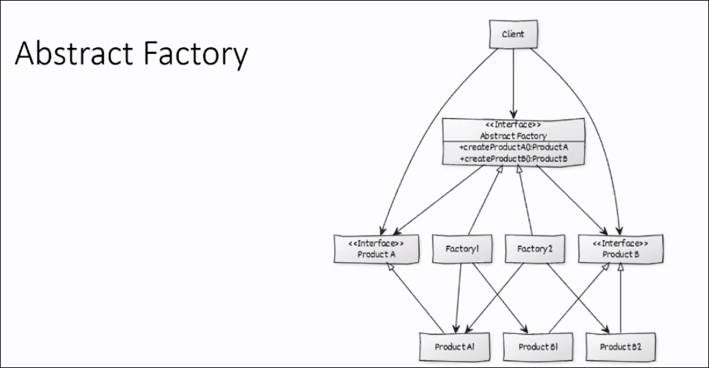
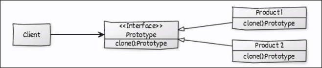

Comment passer de l'architecture au design?

Domaine Model
==============

=Déterminer les données qu'on manipule (par notion et concepts)
Permet de définir un vocabulaire.

API, Contracts and interfaces
==============================

Contracts= langage entre les composant d'un logiciel

Le programme peut être fait en parallèle si on a un bon contract.

API= Application Programming Interface

SLA= un accord entre le client et le fournisseur du contraict. De calcule en service par seconde.

Faire une docummentation (Swagger)

## Service REST
REST est un protocol
Representationnal state transfer
L'état de la session est gardé du côté du client
On peut ainsi exploiter plusieurs serveurs donc améliore la scalabilité (car ils deviennent stateless).
Ainsi les requêtes contiennent toutes les infos nécessaires (autoporté).
On peut faire du code à la demande.

Desing Patterns
================
=façon d'écrire le code (formel)

On peut créer des design patterne.

* Documenter des solutions
* Types de patterns:
	* Creational: création efficiente d'objets
	* Structural: organisation de classe et objets
	* Behavioral: communication entre objets

Exemples de Design Patterns
============================

## Singleton
Garantie d'une seul instance d'une classe.
Évite le cash (plusieurs instances qui se battent sur une même ressource)

## Abstract factory
Creational pattern
Le client a un contract et ne connais pas l'implémentation du contract.
Permet de changer le programme qu'à un endroit

Le client n'interroge que les interfaces.
Les "vrai" produits ont leurs propres interface qui seront utilisés par le client.

## Prototype
Aide à la création d'objet.

On copie la structure en question et faire ce qu'il faut
Besoin d'une interface cloneable qui va pouvoir cloner un Prototype
Shallow copy= le contenu de l'objet reste le même (attention, risque d'effet de bord)
Deep copy= le contenu de l'objet est modifier dans sa structure et tout ses composantes (perfect copy)

## Adapter
Ou wrapper. Cela permet d'ajouter un autre objet d'une autre librairy pour pouvoir l'adapter à un interface propre.
