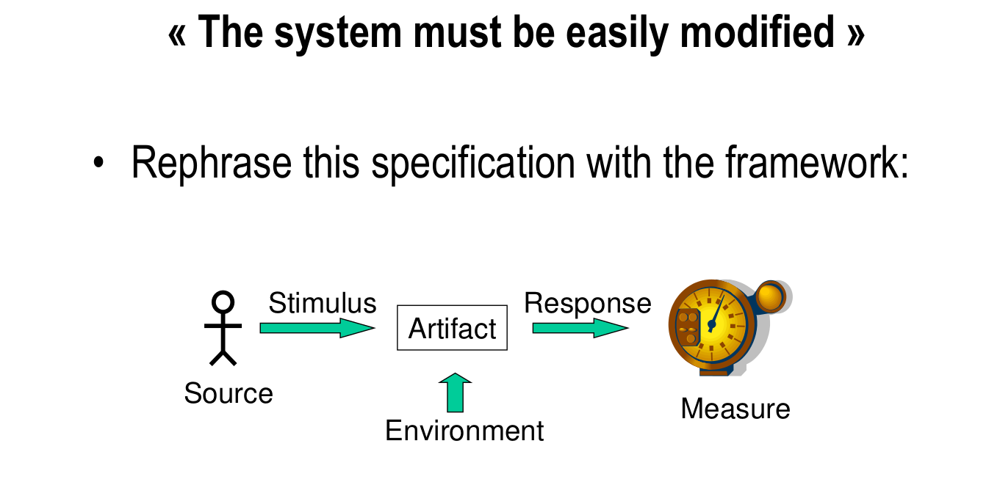

QA: Quality attribute

## C'est quoi un NFR (visible/invisible)?
	Non-Functionnal requirement. C'est un document permettant de présenter les propriété globales non-fonctionnelles.
	Cela permet de spécifier plus facilement l'architecture de la solution.
	
## C'est quoi un scénario SEI?
	Permet de spécifier l'écriture du NFR par une approche axée scénario.
	
On remplace Chaque label de l'image d'en haut par un composant de notre scénario.

## Stakholder:
Dans un contexte commercial, une partie prenante est une personne ou une organisation qui a un intérêt légitime dans un projet ou une entité.
