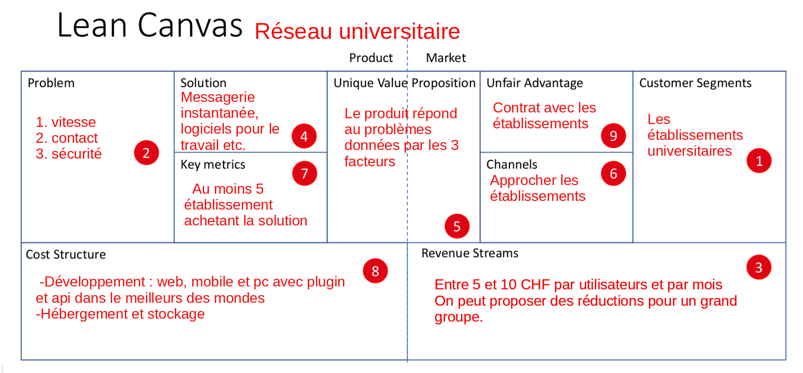

Lean Canevas du projet
======================

## 1. Customer segement
Les étudiants et les professeurs

## 2. Problem
**Problèmes à résoudre:**
1. vitesse
2. contact
3. sécurité

## 3. Revenue Stream
5 CHF par utilisateur et par mois

## 4. Solution
1. messagerie instantanée (whatsapp, télégram,...)
2. logiciel pour le travail (teams, moodle, ...)
3. linkedIn (logiciel de réseautage)

## 5. Unique Value Proposition
Ce produit regroupe ces trois facteurs.

## 6. Channels
Approcher les établissements

## 7. Key metrics
Le nombre d'établissement qui acceptent le logiciel.
Créer des réseaux interconnects

## 8. Cost Structure
Développement de logiciel sur plusieurs plateformes (web, pc et mobile) intégrable aussi facilement qu'un plugin
Prix pour l'hébergement (bon serveurs comme amazone). Variable selon le succès du projet

## 9. Unfair Advantage
L'idée en soit est un pas en avant par rapport à la concurrence.
Le but est de décrocher des contrats assez rapidement avec les établissements.

