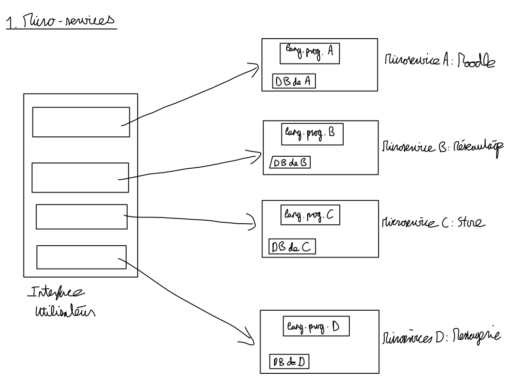
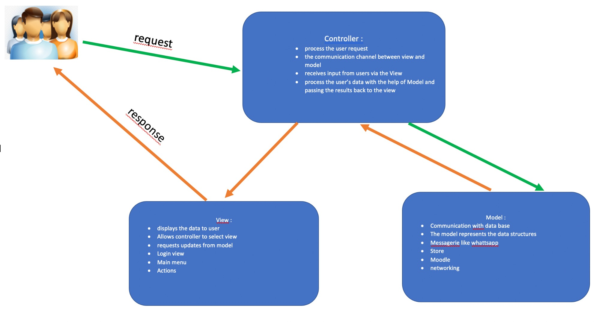
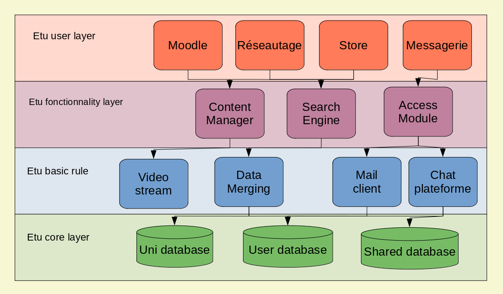

# TD5 Software Engineering

## Oetske Leroux, Mahya Daqiqui, Christina Nguyen, Fabrice Hategekimana

## 1 Microservices

\

## 2 MVC

\

## 3 Layered Architecture

\

### Etu user layer 
Screens, menus and access to the different tools of the application:  

- Moodle
- Messagerie
- Réseautage
- Store
	
	
### Etu functionality layer
Maine menue withe the 4 sections.  
We can navigate between those applications according to what is needed.  
Those applications will send request to those functionality.  
- If a student need to follow his cours via video stream:  
> Go to the moodle section which will call the content manager.  
- If a student need to ask questions and need help for homework about this cours:  
> Go to the messagerie section that would call the Access Module  

### Etu basic rules
To get access to the whole plateform, you need to be a part of the university environnement. Unique username and student/teacher id.  
So the basic rule will decide which ressource to use according to the request of the layer above. For instance, in the résautage section, the are rules about plagiat, copy-right, accessibility, etc.  

### Etu core layer
The core database for the sections, it's subdivided in 3 databases:  

	- University
	- User
	- Shared

The university database is used to store all the datas (documents, media, research, etc.) that concern the University. The user database store data from users and the shared database store information that are shared between many university using this platform.  
If a student uses the Moodle section he would eventually access the university or the user database.  

