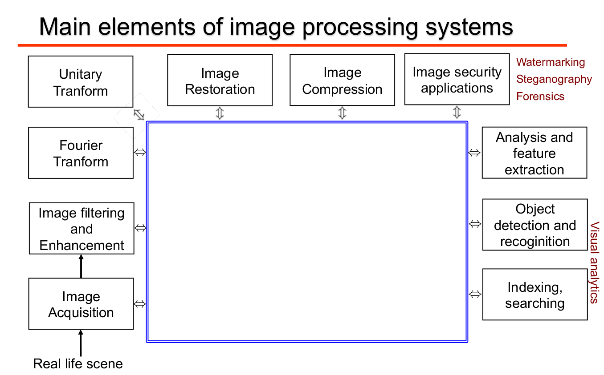

1. intro_image_processing
=========================

A digital images is a representation of a two dimensional scenes as a finite set of digital values called picture elements or pixels.

A digital image is just an approximation of a real scene.

Une image serai normalement énorme en place (des gigas) mais on peut la compresser.

