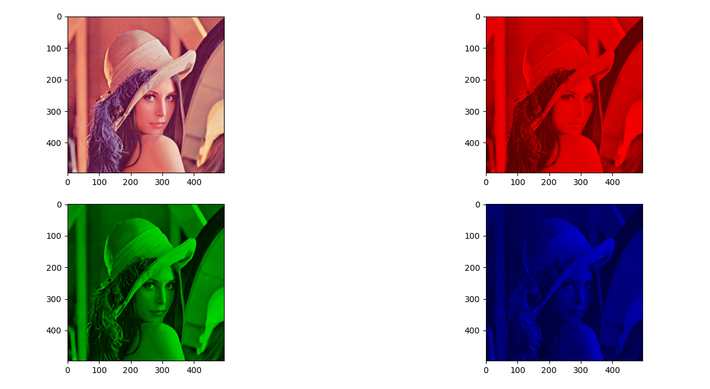
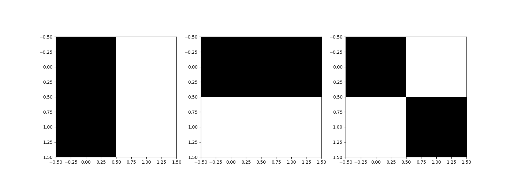
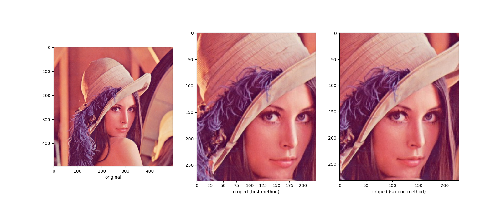
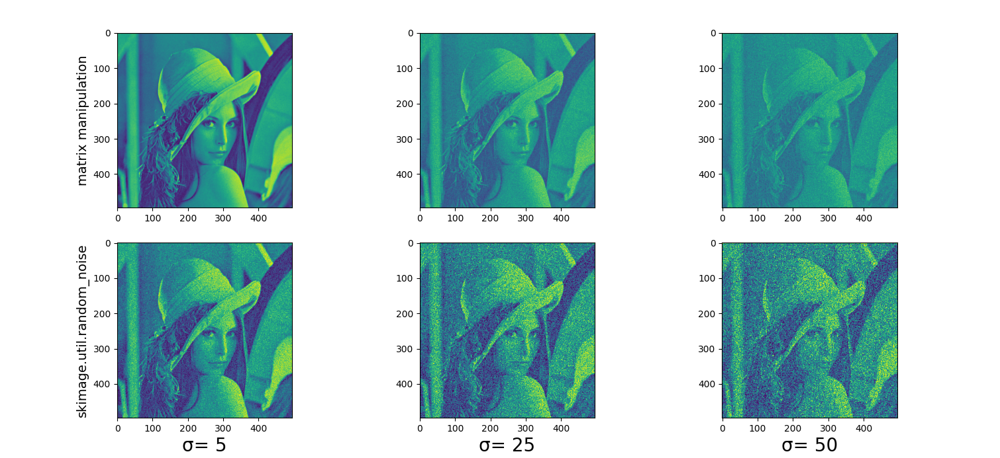
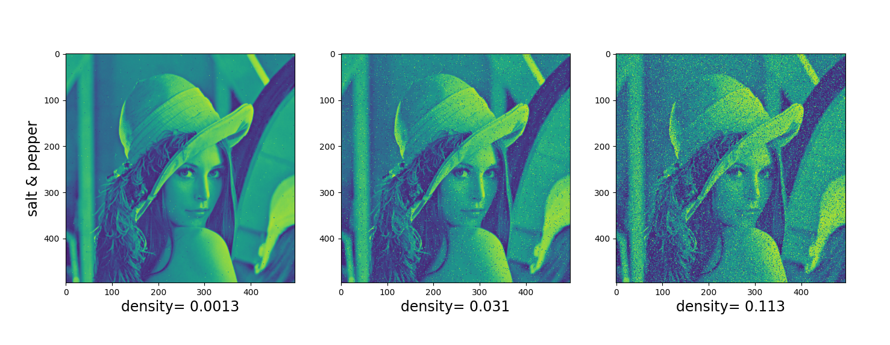

# Python (2 points)
## Exercice 1
(a)Display "lena.png" with python:



## Exercice 2

Gradient


Arithmetic with some Figures



## Exercice 3

Cropping images with two methods



## Exercice 4

White noise usage



The two methods are different because the matrix manipulation use a complet random distribution as perturbation. With the skimage method, the output will be clipped after noise applied.

## Exercice 5



## Linear algebra

### (a)-----------------------------------------------------------------------------
```python
#(a)
a= np.array([2,-3,4,1,0])
b= np.array([1,2,-5,2,4])
c= np.array([-1,3,0,1,2])

print((4*a)-(2*b)+c)

>>>
```
### (b)------------------------------------------------------------------------------

```python
#(b)
print(((3*(-1))-17)/4)
```

### (c)------------------------------------------------------------------------------
```python
#(c) false because we find (a= -13, 2a= -16, -a= -4)
```
### (d)------------------------------------------------------------------------------
```python
#(d) 
A= np.array([[1,1],[2,3]])
b= np.array([5,0])
print(np.linalg.solve(A,b))
```
### (e)------------------------------------------------------------------------------
```python
#(e)

a= np.array([[1,2,1],[-2,-1,5],[1,3,0]])
def B(x):
    b= np.array([[-1,3,7],[2,3,3],[4,-1,-6],[2,3,4]])
        return np.dot(x,b)
	
	print(np.linalg.solve(a,[0,0,0]))
	print(newton_krylov(B,[0,0,0,0]))
```
### (f)------------------------------------------------------------------------------
```python
#(f)
A= np.array([[1,1],[2,3]])
b= np.array([5,0])
print(np.linalg.solve(A,b))
a= np.array([1,2,3])
b= np.array([4,-5,6])
print(np.dot(a, np.transpose(b)))
```
### (g)------------------------------------------------------------------------------
```python
#(g)
a= np.array([3,-3,1])
b= np.array([4,9,2])
print(np.dot(np.transpose(a), b))
```
### (h)------------------------------------------------------------------------------
```python
#(h) c= 18 scalar product must be 0
```
### (i)------------------------------------------------------------------------------
```python
#(i)
A= np.array([[1,2,3],[4,5,6],[7,8,9],[10,11,12]])
b= np.array([-2,1,0])

print(np.dot(A,b))
```
### (j)------------------------------------------------------------------------------
```python
#(j) There are no solution because their dimention don't match
```
### (k)------------------------------------------------------------------------------
```python
#(k) There are no solution because their dimention don't match
```
### (l)------------------------------------------------------------------------------
```python
#(l) Yes because of commutativity
```
### (m)------------------------------------------------------------------------------
```python
#(m) Yes because of associativity
```
### (n)------------------------------------------------------------------------------
```python
#(n) No, (prove with example)
```
### (o)------------------------------------------------------------------------------
```python
#(o) No, (prove with example)
```
### (p)------------------------------------------------------------------------------
```python
#(p)

B= np.array([[1,2,3], [4,5,6]])
C= np.array([[1,2],[3,4],[5,6]])
print(np.dot(B,C))
```
### (q)------------------------------------------------------------------------------
```python
#(q)
M= np.array([[2,1,-1],[3,5,#(j) There are no solution because their dimention don't match

print(np.linalg.matrix_rank(M))
```
### (r)------------------------------------------------------------------------------
```python
#(r)
A= np.array([[4,4],[2,-5]])
B= np.array([[1,1,2],[2,3,1],[3,4,-5]])
C= np.array([[1,0,0,3],[2,1,0,1],[3,0,5,4],[0,3,2,2]])

print(np.linalg.det(A))
print(np.linalg.det(B))
print(np.linalg.det(C))
```
### (s)------------------------------------------------------------------------------
```python
#(s) if deti(M) != 0 it is inversible

M= np.array([[-1,1,1,0],[0,0,-1,0],[0,0,1,-1],[0,0,1,0]])

print(np.linalg.det(M))
```

# Probability and statistic (2 points)

