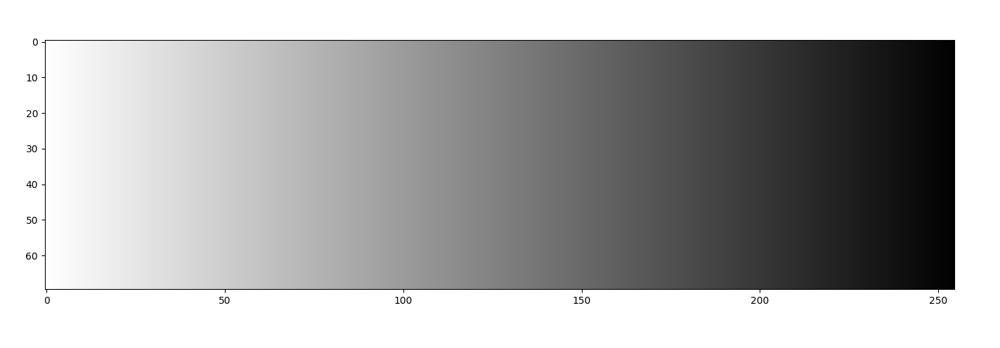
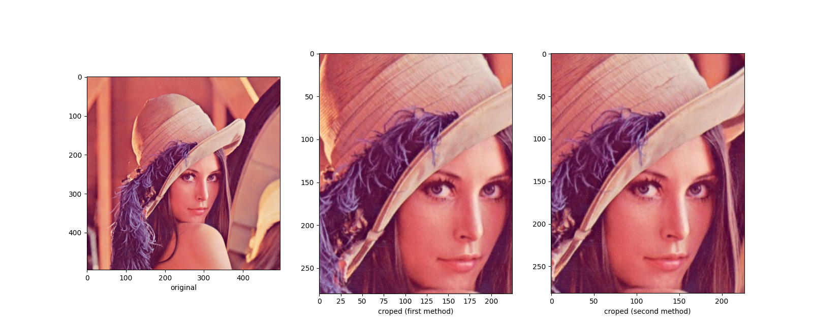
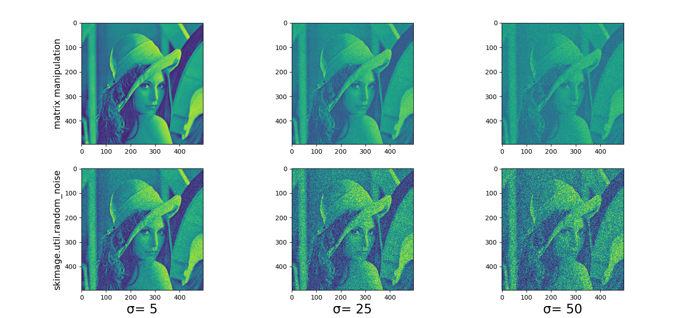

# Python (2 points)
## Exercice 1
**Display "lena.png" with python:**

{ width=70% }

The image is of size 400x400 pixel.
Each pixel is an vector of four parameters:

[r, g, b, a]

r: red
g: green
b: blue
a: alpha channel (opacity)

The 3 first parameter are colors and the fourth is used for the transparency.
The combination of those 3 colors can create much more color. In fact each of them can be represented with one byte (8 bit so $2^8$ = 256 values).
We can obtain 256 x 256 x 256 = 16777216 colors. This is more than enough to represent the spectral color which can be seen by humans.

## Exercice 2
**Gradient**

{ width=60% }


**Arithmetic with some Figures**

I used the [0, 1] scale for my figures. I also used addition, substation and multiplication for this exercice. After each calculus, I reajuste each value to the [0, 1] scale.
To find the figure at the right, I used figure a and b in this formula:
$c = (a+b)-(a*b)$

{ width=60% }

The right on is the computation's result of the others.
   
## Exercice 3
**Cropping images with two methods**

{ width=60% }

The second method seem more accurate and less painful than the first one. Moreover, we prefer to manipulate the "borders" of a image when we crop.

## Exercice 4
**White noise usage**

{ width=80% }


The two methods are different because the matrix manipulation use a complet random distribution as perturbation. With the skimage method, the output will be clipped after noise applied.

## Exercice 5

{ width=80% }


**From the MSE, I obtain:**  
a) 0.00040872252765619807 for density = 0.0013  
b) 0.009017316252373255 for density = 0.031  
c) 0.03251101926460906 for density = 0.113  


## Linear algebra

### (a)-----------------------------------------------------------------------------
We just have to compute.
```python
a= np.array([2,-3,4,1,0])
b= np.array([1,2,-5,2,4])
c= np.array([-1,3,0,1,2])

print((4*a)-(2*b)+c)

>>> [  5 -13  26   1  -6]
```
### (b)------------------------------------------------------------------------------
3*1 + 4*2 = 3+8 = 11 Okay
3*2 + 4*0= 6+0 = Okay
finally, this is just a simple equation with x
```python
print(((3*(-1))-17)/4)

>>> -5.0
```

### (c)------------------------------------------------------------------------------
(c) false because we find (a= -13, 2a= -16, -a= -4)
  
### (d)------------------------------------------------------------------------------
We can solve it with a linear representation Ax=b where:  
$A= \begin{pmatrix} 1 & 1 \\ 2 & 3 \end{pmatrix}$  
$b= \begin{pmatrix} 5 \\ 0 \end{pmatrix}$  

```python
A= np.array([[1,1],[2,3]])
b= np.array([5,0])
print(np.linalg.solve(A,b))

>>> [ 15. -10.]
```
### (e)------------------------------------------------------------------------------
A set of vector is linearly dependent if the only way to obtain $0_E$ is to multiply 
each vector by zero. If there are other ways to do so, the set of vector is not linearly dependent.  
We just have to compute Ax=b and resolve it (linearly if it's a square matrix or non-linearly if it's not a sqare matrix).  
In this case, both of the sets are linearly independent.  
```python
a= np.array([[1,2,1],[-2,-1,5],[1,3,0]])
def B(x):
    b= np.array([[-1,3,7],[2,3,3],[4,-1,-6],[2,3,4]])
        return np.dot(x,b)
	
	print(np.linalg.solve(a,[0,0,0]))
	print(newton_krylov(B,[0,0,0,0]))
	
>>> [-0.  0.  0.]
>>> [0. 0. 0. 0.]
```
### (f)------------------------------------------------------------------------------
We just have to do the calculus $ab^T$
```python
a= np.array([3,-3,1])
b= np.array([4,9,2])
print(np.dot(a, np.transpose(b)))

>>> 12
```
### (g)------------------------------------------------------------------------------
We just have to do the calculus $a^Tb$
To calculate the angle between two vectors we just have to use:  
$\alpha = \arccos{ \frac{(u * v)}{||u|| * ||v||}}$ Where:  
u and v are two vectors
In this case the angle is small.
```python
#(g)
a= np.array([1,2,3])
b= np.array([4,-5,6])

#the scalar product
print(np.dot(np.transpose(a), b))

#angle between the two vectors
print(np.arcos(np.dot(np.transpose(a), b)/(np.norm(a)*np.norm(b))))

>>> -13
>>> 1.8720947029995874

```
### (h)------------------------------------------------------------------------------
If two vectors are perpendicular, the scalar product must be 0. So:
$6*4 + -1*c + 3*(-2) = 24-c-6 = 0$  
$c= 25-6$  
$c= 18$    
  
### (i)------------------------------------------------------------------------------
```python
A= np.array([[1,2,3],[4,5,6],[7,8,9],[10,11,12]])
b= np.array([-2,1,0])

print(np.dot(A,b))

>>> [ 0 -3 -6 -9]
```
### (j)------------------------------------------------------------------------------
There are no solution because their dimension don't match.
A dot product is done with row-column product but here column(A)= 3 and Row(y)= 4.
  
### (k)------------------------------------------------------------------------------
For addition, the matrix must have the exact same dimension.
There are no solution because their dimension don't match dim(A)= (2,3) and dim(C)= (3,2)
  
### (l)------------------------------------------------------------------------------
Yes because of the commutativity of the addition. (And they must have the required dimension for the specific operator)
  
### (m)------------------------------------------------------------------------------
Yes because of associativity of the addition. (And they must have the required dimension for the specific operator)
  
### (n)------------------------------------------------------------------------------
No, (prove with example)
```python
```
### (o)------------------------------------------------------------------------------
No, (prove with example)
```python
B= np.array([[2,3],[4,4]])
C= np.array([[0,4],[1,6]])
print(np.dot(B,C))
print(np.dot(C,B))

>>> [[ 3 26]
     [ 4 40]]
>>> [[16 16]
     [26 27]]
```
### (p)------------------------------------------------------------------------------
we just have to compute.
```python
B= np.array([[1,2,3], [4,5,6]])
C= np.array([[1,2],[3,4],[5,6]])
print(np.dot(B,C))

>>> [[22 28]
     [49 64]]
```
### (q)------------------------------------------------------------------------------
we just have to compute. The rank is the dimension of the matrix (if all his vectors are independent)
```python
M= np.array([[2,1,-1],[3,5,-7],[4,-5,-6]])
print(np.linalg.matrix_rank(M))

>>> 3
```
### (r)------------------------------------------------------------------------------
we just have to compute.
```python
A= np.array([[4,4],[2,-5]])
B= np.array([[1,1,2],[2,3,1],[3,4,-5]])
C= np.array([[1,0,0,3],[2,1,0,1],[3,0,5,4],[0,3,2,2]])

print(np.linalg.det(A))
print(np.linalg.det(B))
print(np.linalg.det(C))

>>> -27.999999999999996
>>> -7.999999999999998
>>> 95.0
```
### (s)------------------------------------------------------------------------------
A matrix is inversible if his determinant is not 0.
We just have to compute.  
In this case, the matrix is not inversible.
```python
M= np.array([[-1,1,1,0],[0,0,-1,0],[0,0,1,-1],[0,0,1,0]])

print(np.linalg.det(M))

>>> 0.0
```
# Probability and statistic (2 points)

## (a) Probability mass function
pmf of Bernoulli:  
$P(X=x)=P^x (1-p)^{ 1-x}, x \in {0,1}$

pmf of Binomial:  
$P(X=k)=\begin{pmatrix} n \\ k \end{pmatrix}p^k(1-p)^{n-k}$

## (b) Probability density function
pdf of Uniform:  
$f(x)=\frac{1}{2a} if a<x<b; 0 else$

pdf of Normal:  
$f(x)=\frac{1}{\sigma \sqrt{2 \pi}}e^{-\frac{1}{2}(\frac{x- \mu}{\sigma})^2}$

## (c) Simple diagramm


### Venn diagram for A={1,2} and B={2,3}
### We will discuss the set concerned in those cases:
## $A \cup B$
## $A \cap B$
## $A^c$
## $A - B$

---
  
{ width=50% } 

{ width=40% }

{ width=40% }

{ width=40% }

{ width=40% }

      
      
      
## (d) Probability of random variables

a) $PX(x)$

X	Px(x)
-	-----
0	1/4
1	3/4

b) $PY(y)$

Y	Py(y)
-	-----
0	1/2
1	1/2

c) $PX|Y(x,Y=0)$

X	PX|Y(x,Y=0)
-	-----------
0	1/2
1	1/2

d) $PY|X(y,X=1)$

X	PY|X(y,X=1)
-	-----------
0	1/3
1	2/3

e) $E[X]$
$E[X]= PX(0)*0+PX(1)*1= \frac{3}{4}$

f) $E[X|Y=0]$
$E[X|Y=0]= PX(0)*0+PX(1)*1= \frac{1}{2}$

g) $Var[X]$
$Var[X]= PX(0)*0^2+PX(1)*1^2= \frac{3}{4}$
