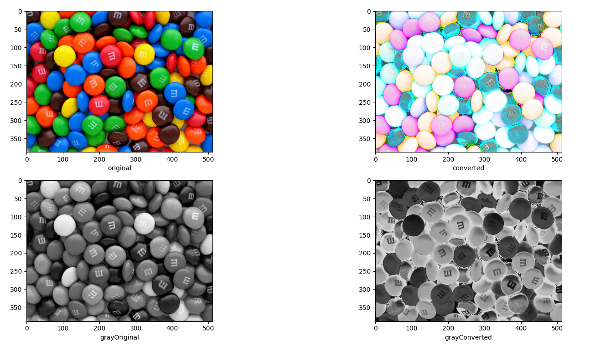

## Exercice 1

(a) The main components of the HVS as an optical system are:
- the eyes:
	- cones
	- rodes
- Percieved information:
	- luminance
	- brightness

(b) Human eye percieve color with the help of the cones wich are packed in Fovea.
Acromatic light is percieved by Rods and is characterized by the intensity of light. It varies from black light to white. The intermediate level is gray.  
Chromatic light is percieved by the cones and is charaterized by 3 quantities:
	1. Radiance is a total amount of energy emmited by a source of light [watts]
	2. Liminace is a measure of the amount of energy that an observer perceives from the light source. We can consider it as filtered by the HVS
	3. 3. Brigtness is a subjective evaluation what is the source of radiation we talk about.

## Exercice 2
Done with the code:  


## Exercice 3
(a) YIQ is the color space used by NTSC (National Television System Committee) color TV system. This is used for television.
It have an advantage against RGB because it posses the Y parameter wich indicate the intensity in the chromatic TV, that is really practical for screens.

(b)

Y represents luma component (intensity in the chromatic TV)
I represents orange-blue range of colors
Q represents purple-green range of colors

(c)

I tested the skimage.color.rgb2yiq but I didn't find any difference with my custom function

(d)
I computed back with the skimage.color.yiq2rgb and computed the mse and find:
```bash
5.585817567946941e-33
```
So the functions are really accurate.

## Exercice 4
(a) 
YUV (or Y’UV) is the color space used by PAL color TV system (analog TV)
YCbCr (aka YCC) is a digital “equivalent” of YUV used in digital formats JPEG and MPEG

(b)

Y’ – represents luma component (different from Y in XYZ due not non-linearly corrected
RGB components; not equi-proportional sum of RGB)
U/Cb – represents blue difference component
V/Cr – represents red difference component

(c)

I tested the skimage.color.rgb2yuv but I didn't find any difference with my custom function

(d)
I computed back with the skimage.color.yiq2rgb and computed the mse and find:
```bash
5.0876051952196524e-33
```
So the functions are really accurate.

## Exercice 5
(a)
CMY is a color format used for printing. This format is better to represent color in paper (for document, newspapers, posters, etc.).

(b)

C= cyan
M= magenta
Y= yellow

(c)
There isn't a builtin function for cmy

(d)
I computed back with my custom function and computed the mse and find:
```bash
8.06924923876093e-34
```
So the functions are really accurate.

## Exercice 6
(a)
CMYK is the same as CMY but it has another parameter: black. It is optimised to manage more efficiently black and white in printing.

(b)

C= cyan
M= magenta
Y= yellow
K= black

(c)
There isn't a builtin function for cmy.

(d)
I computed back with my custom function and computed the mse and find:
```bash
3.950553400907055e-11
```

## Exercice 7

There are for exemple, the Near-sightedness, the far-sightedness and the presbyopia.    


They are generally solved with adaptative glasses.
There is also the color blindness where a person can't see difference between colors (generally it's red and green). The origin is genetical and this desease don't really evolve with time. 
Nowaday, there are no cure to solve this problem but there are some other solution like colored glasses that tend to helpNowaday, there are no cure to solve this problem but there are some other solution like colored glasses that tend to help people to distinguish more efficiently the colors.


