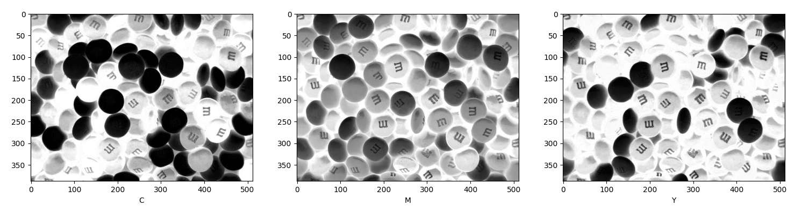
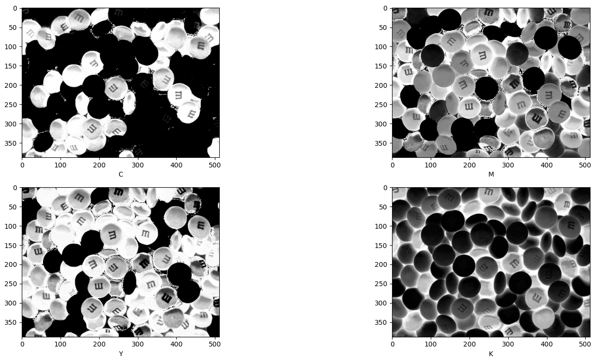
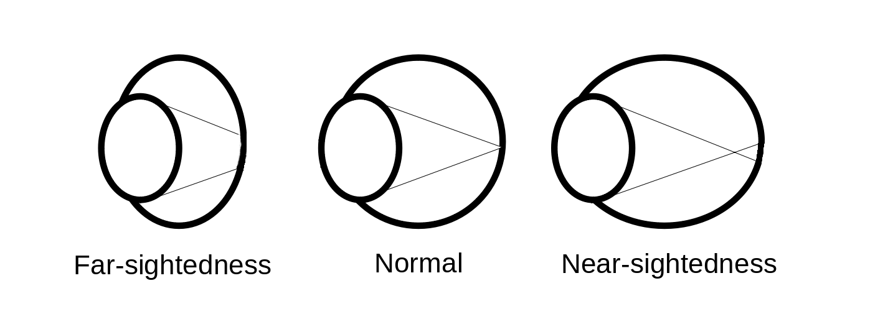

## Exercice 1

(a) The main components of the HVS as an optical system are:
- the eyes:  
	- cones
	- rodes
- Perceived information:
	- luminance
	- brightness

(b) Human eye perceive color with the help of the cones which are packed in fovea.  
Acromatic light is perceived by Rods and is characterized by the intensity of light. It varies from black light to white. The intermediate level is gray.    
Chromatic light is perceived by the cones and is characterized by 3 quantities:  
	1. Radiance is a total amount of energy emitted by a source of light [watts]  
	2. Luminance is a measure of the amount of energy that an observer perceives from the light source. We can consider it as filtered by the HVS  
	3. Brightness is a subjective evaluation what is the source of radiation we talk about.  

## Exercice 2
Done with python:

### Red scale decreasing to zero (10 steps)
\

### Green scale decreasing to zero (10 steps)
\

### Blue scale decreasing to zero (10 steps)
\

## Exercice 3
(a) YIQ is the color space used by NTSC (National Television System Committee) color TV system. This is used for television.  
It have an advantage against RGB because it posses the Y parameter wich indicate the intensity in the chromatic TV, that is really practical for screens.  

(b)
\
\
Y represents luma component (intensity in the chromatic TV)  
I represents orange-blue range of colors  
Q represents purple-green range of colors  

(c)
\
I tested the skimage.color.rgb2yiq but I didn't find any difference with my custom function  

(d)
I computed back with the skimage.color.yiq2rgb and computed the mse and find:  
```bash
									5.585817567946941e-33
```
So the functions are really accurate.  

## Exercice 4
(a) 
YUV (or Y’UV) is the color space used by PAL color TV system (analog TV)  
YCbCr (aka YCC) is a digital “equivalent” of YUV used in digital formats JPEG and MPEG  

(b)
\
\
Y’ – represents luma component (different from Y in XYZ due not non-linearly corrected  
RGB components; not equi-proportional sum of RGB)  
U/Cb – represents blue difference component  
V/Cr – represents red difference component  

(c)
\
I tested the skimage.color.rgb2yuv but I didn't find any difference with my custom function  

(d)
I computed back with the skimage.color.yiq2rgb and computed the mse and find:  
```bash
									5.0876051952196524e-33
```
So the functions are really accurate.  

## Exercice 5
(a)
CMY is a color format used for printing. This format is better to represent color in paper (for document, newspapers, posters, etc.).  

(b)
\
\
C= cyan  
M= magenta  
Y= yellow  

(c)
There isn't a builtin function for cmy  

(d)
I computed back with my custom function and computed the mse and find:  
```bash
									8.06924923876093e-34
```
So the functions are really accurate.  

## Exercice 6
(a)
CMYK is the same as CMY but it has another parameter: black. It is optimised to manage more efficiently black and white in printing.  

(b)
\
\
C= cyan  
M= magenta  
Y= yellow  
K= black  

(c)
There isn't a builtin function for cmy.  

(d)
I computed back with my custom function and computed the mse and find:  
```bash
									3.950553400907055e-11
```

## Exercice 7

### Sharpness
There are for exemple, the Near-sightedness, the Far-sightedness and the presbyopia.      

- Near sightedness:
	- Problem: The eye's length is too small so the focal point exceed the Fovea's localisation
	- Solutions:
		- Can be corrected with lasers
		- We used corrective lenses to help
- Far sightedness:
	- Problem: The eye's length is too small so the focal point exceed the Fovea's localisation
	- Solutions:
		- Can be corrected with lasers
		- We used corrective lenses to help
- Presbyopia:
	- Problem: The lens has less accommodation potential by aging so the ability to focus clearly on close objects
	- Solutions:
		- There is no cure
		- We use corrective lens to help


\

\

### Colors
- Color blindness:
	- Problem: The cones in the eye aren't functioning correctely so the perception of colors is biased.
	- Solutions:
		- There is no cure
		- Colored glasses can help distinguishing color

\

