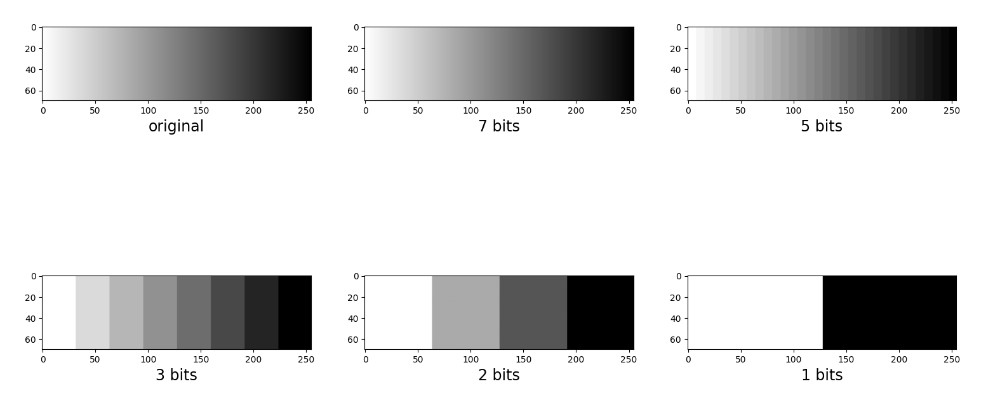

## Exercice 1
(a)
100x100= 10'000 pixels
256= 2^8 = 8 bits/pixel
finaly= 80'000 bits or 10'000 bytes

(b)
100x100= 10'000 pixels
4= 2^2 = 2 bits/pixel
finaly= 20'000 bits or 2'500 bytes

So a is four times bigger than b

## Exercice 2
Sampling and quantization are two methode of reducing the size of a (non)continuous function with a discret (co)domain.
Sampling: Cut distance by a (ir)regular step (define a discret domain)
Quantization: Cut by amplitude by (in)regular step (define a smaller codomain)

## Exercice 3
I have made a function that sample a given function (f(x,y)) with a given step.
I have also made a function that make a quantization of a given function (f(x,y)) with a given step.
The images are below.

\

\

## Exercice 4
I made a function that encode a given image with the amount of bit given in tne parameters. 
I ploted the encoding of 7, 5, 3, 2, 1 bit(s) for the  grayscal gradient and lena.png (original + 5 images= 6 images)
\

\
 
## Exercice 5
(a)
I have made 10 copy of lena.png with a gaussian noise (zero-mean et sigma 25).
I used for that the numpy.random.normal function (encapsulated in gaussian blur).
I also made an array of them for further usage.
(b)
For eache noisy image of lena.png, I made a PSNR with the original.
Finally, I made the mean of all those PSNR and I found:
```
	psnr mean:  11.497030549901748
```
(c)
To do the frame averageing, I simply made a sum of all the noisy image (pixel per pixel) and I divided the result by 10.
(d)
```
	psnrAverage:  11.645832619939648
```
The frame averaging works when the noise is not so big.

## Exercice 6
(a)
I opended reference.bpm and noisy.bpm
I ploted each image with his own (RGB) channels
\
\

I made a PSNR with each chanel and see the total:
```
psnr red   channel:  13.278653649294078
psnr green channel:  15.935008236845567
psnr blue  channel:  10.261868583985914
psnr total:          12.553158959644847
```

(b)  
I downsampled and resampled back to obtain thoses results (image and PSNR)   
\  
total color:  22.877167728588645  

(c)  
I downsampled and resampled back to obtain thoses results (image and PSNR)   
\  
psnr total gray:  29.228188485155208  

(d)  
We can denoise images with the combination of mean and quantization.  
