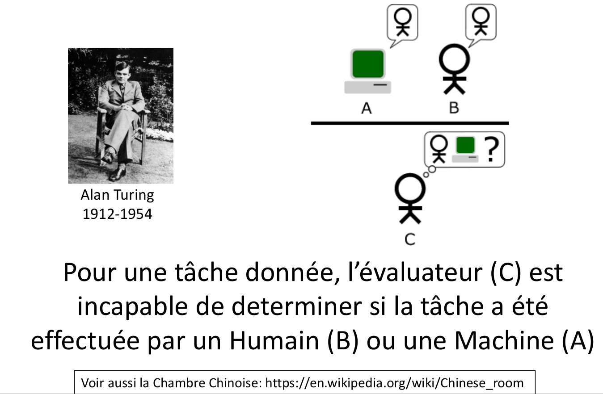
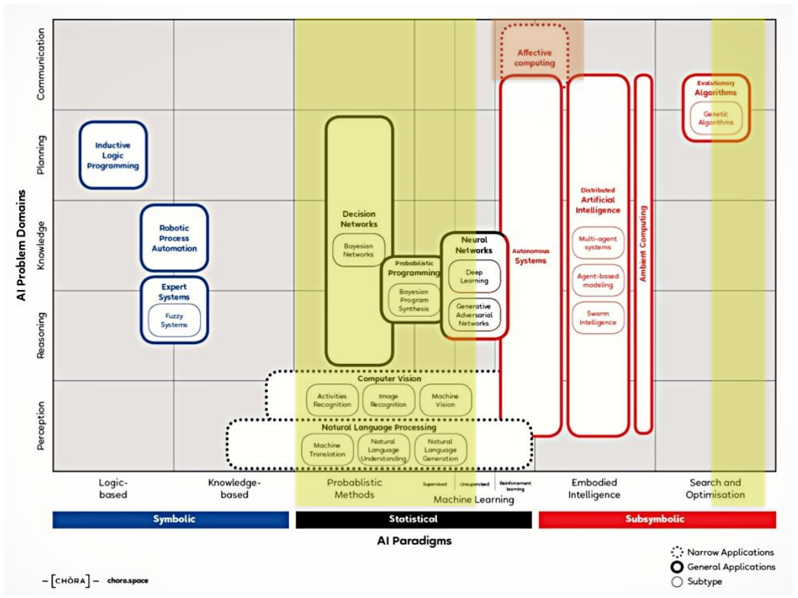
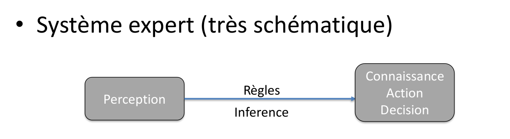

Intelligence Artificielle
=========================

Visualgo

TP toutes les 2-3 semaines

Évaluation TP=1 Oral=5
On a le droit au cours (conseil du professeur: avoir un résumé de 10 pages max)

Concept:
========

Intelligence artificielle: 
	* prise de décision
	* adaptation (souvent en temps réel)

> Capacité à prendre de (bonnes) décisions en fonction du contexte (Environnement)

Boucle action-perception

Décomposition de l'agent:
	* Capteurs
	* Intelligence
	* Effecteurs

L'IA est robuste car on la fait travailler dans un domaine bien délimité et elle ne produira seulement des éléments appartenant à ce domaine.
On peut se poser la question de la créativité. Est-ce qu'une machine peu créer qqch d'inovant.

## Test de Turing

> Les IAs peuvent battre dans certains cas des humains dans un milieux "académique" (en labo mais pas dans la vrai vie).
> L'IA existe depuis longtemps (1945) mais on fait des gros progrès récemment (2010)

## contenu du cours
[Méthode_de_recherche](Méthode_de_recherche)
Satisfaction de contraintes
Jeux
Planification
Méthode probabilistes
Apprentissage
Compléments

Le cours se divise en 2 parties
===============================

## 1. Algorithmique
Système expert à règles (connaissance innée)
La richesse est dans les algorithmes
Défaut: ne permet pas de gérer efficacement les exceptions

Règle "is a" qui est une façon de définir les données

Langage [RDF](RDF), pour l'Ontologie. Il y a aussi la recherche du web semantic

## 2. Statistique
Apprentissage statistique (Machine Learning) (connaissances apprises)
La richesse est dans la qualité/quantité des données

