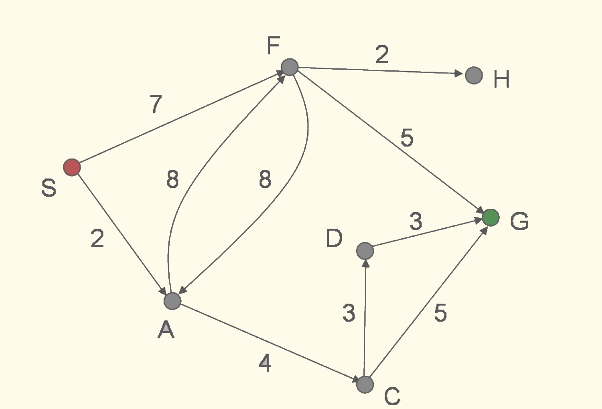
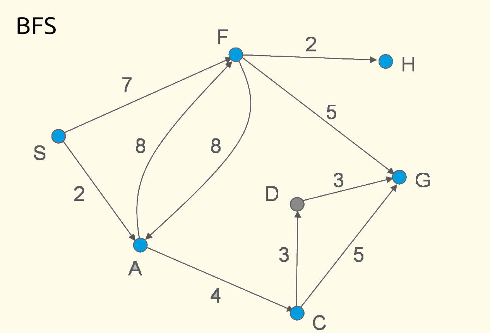
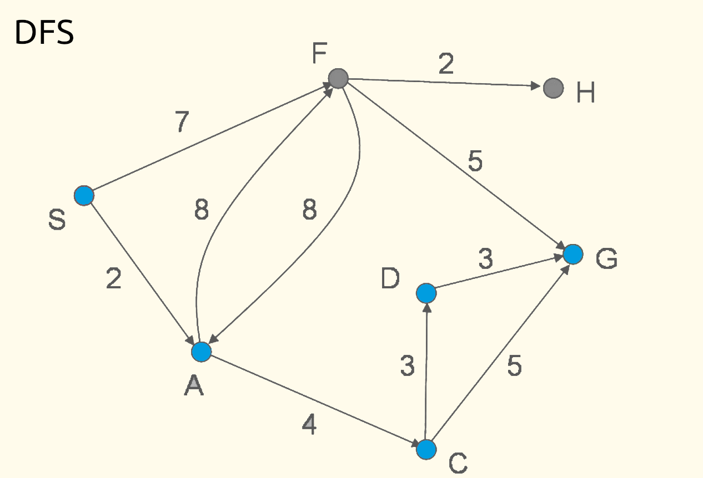

# Hategekimana Fabrice
# 1 Simulation de l'algorithme A*

## 1.1 Recherche aveugle
Le graphe normal
{ width=10% }

- recherche en largeur
{ width=10% }
(A,F,C,G,H)

- recherche en profondeur
{  width=10% }
(A,C,D,G)

## 1.2 Recherche heuristique
- Cette fonction est admissible car, par définition, une heuristique est admissible si elle sous-estime le coût d'un chemin passant d'un point à un autre.
- La fonction d'évaluation de la méthode greedy best first search est une fonction de tri (sort) qui va trier dans l'ordre chaque noeud et les explorer dans ce sens.
- La fonction d'évaluation de la méthode A* utilise une heuristique admissible mais n'est pas consistante. Cependant elle reste optimale

**Définitions utilisées:**

> def: une heuristique est dite admissible si elle sous estime le coût du chemin d'un point à un autre.
> 
> def une heuristique est dite consistante si elle respecte cette condition:
> - S'il existe une transition de s à s' de coût c(s,s') alors h(s)<=h(s')+c(s,s')
> 
> - l'algorithme A* est l'algorithme Best first search avec une fonction d'evaluation:
> 	- f= g(v)+h(v)
> 	- où  est une heuristique admissible et consistante et c(s,s')>= epsilon > 0 pour tout s et s'
> 	- Alors l'algoritme A* est complet et optimal

### Greedy Best first
1. Greedy best first search crée la racine de l’arbre de recherche N0 avec l’etat S et f(N0) = 0 Ensuite, il va ettendre successivement
 les noeuds suivants :
2. N0, pour créer N1 avec l’état A et f(N1) = 2, et N2 avec l’état F et f(N2) = 7.
3. N1, pour créer N3 avec l’état F et f(N3) = 8, et N4 avec l'état C et f(N4) = 4.
4. N4, pour créer N5 avec l'état D et f(N5) = 3, et N6 avec l'état G et f(N6) = 5.
5. N5, pour créer N7 avec l'état G et f(N7) = 3
 
### A*  

1. A* search crée la racine de l’arbre de recherche N0 avec l’etat S et f(N0) = 10 Ensuite, il va ettendre successivement les noeuds suivants :    
2. N0, pour créer N1 avec l’état A et f(N1) = 5, et N2 avec l’état F et f(N2) = 4.  
3. N2, pour créer N3 avec l'état H et f(N1) = 2, et N4 avec l'état G et f(N4) = 0.  
