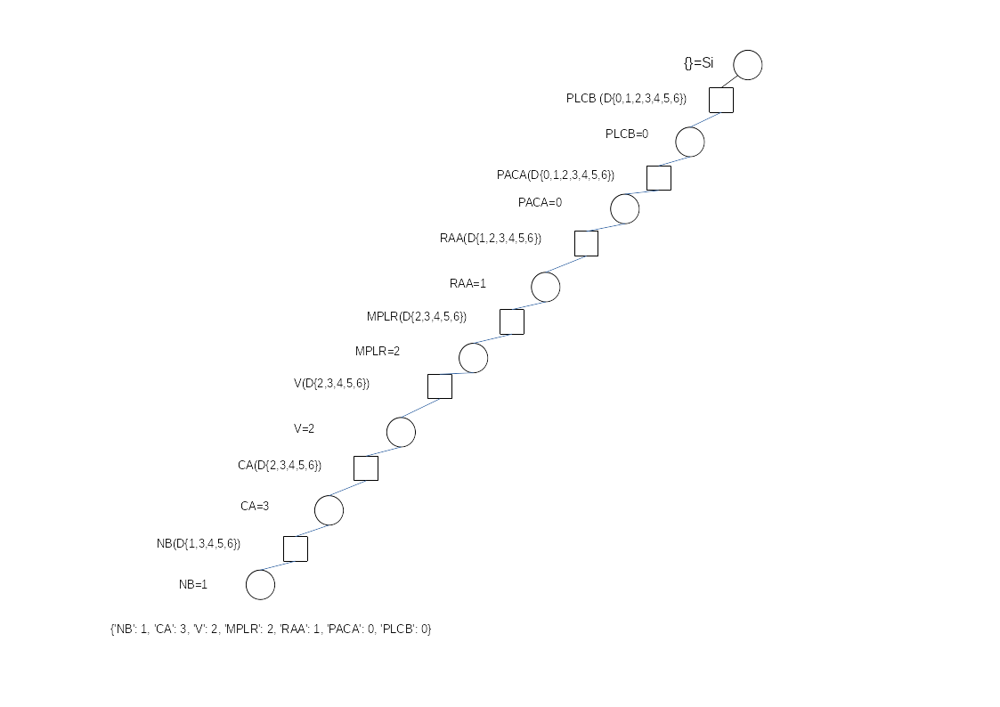
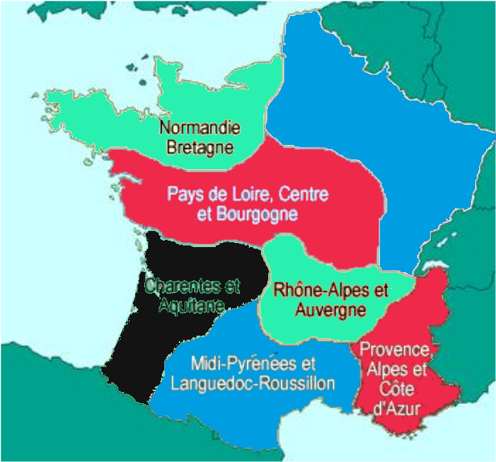
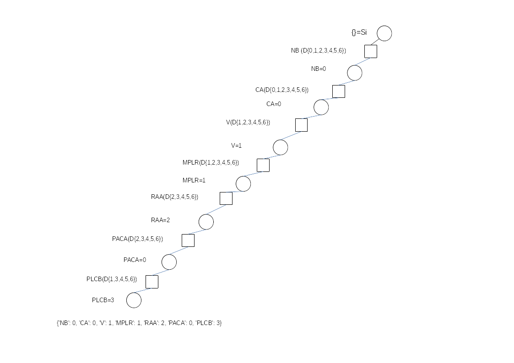
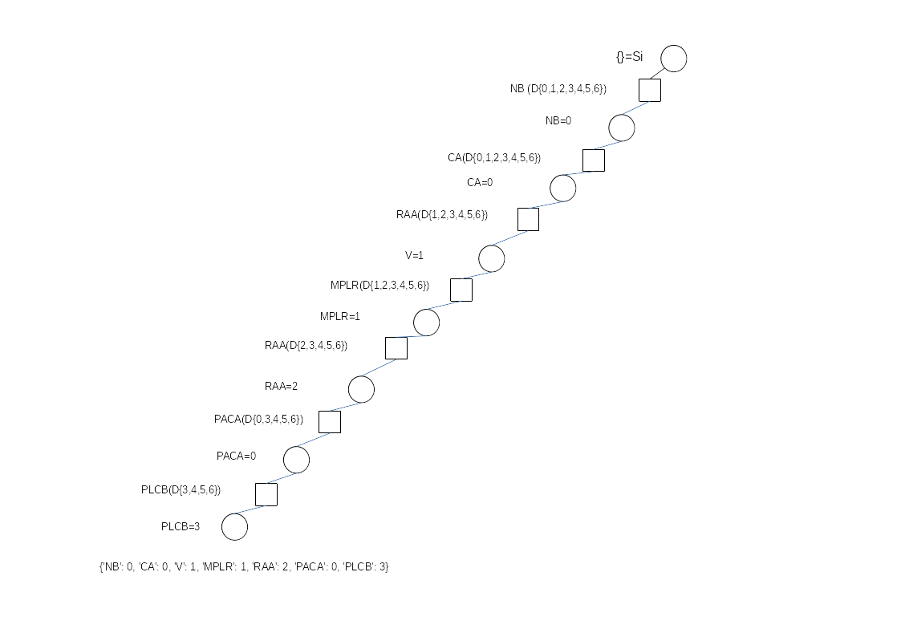
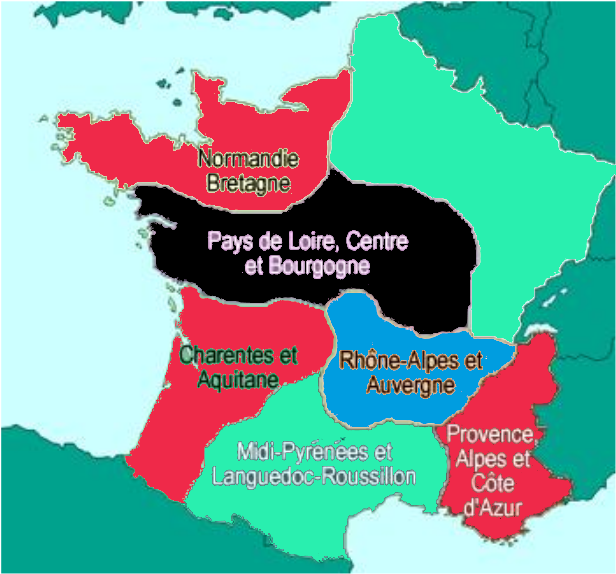
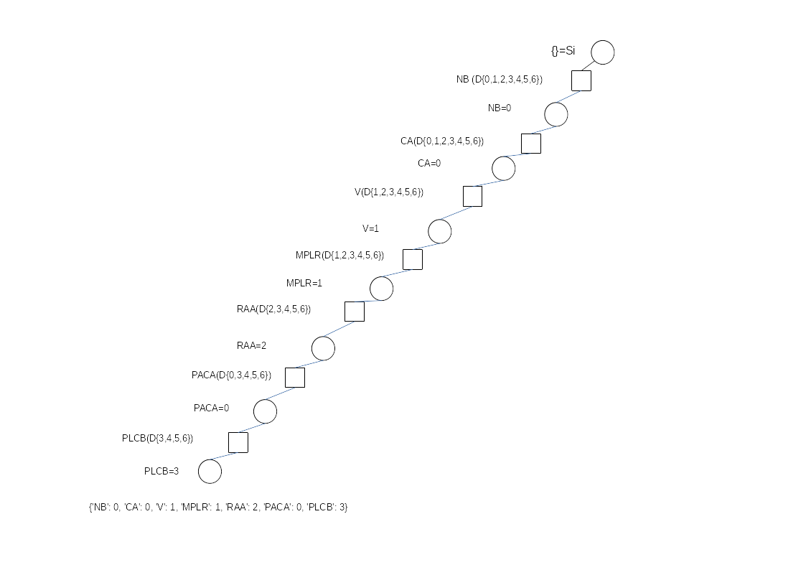

Satisfaction de contraintes
===========================

## 5.1 Formalisation  

Modélisez le problème sous forme d'un CSP.  
Variables du problème: 

1. Se sont les régions qui peuvent prendre un ensemble de couleurs différentes.
2. Le champs des couleurs doit être minimal mais on a au maximum le choix à 7 couleurs différentes (autant de couleur que de régions):
3. Pour les contrainte c'est simple.
	- Aucune couple de régions adjacent ne peut avoir la même couleurs (pris deux à deux)
	- Il doit y avoir un ensemble minimal de couleur utilisées.
**Note: **
je n'ai pas utilisé de nom de couleur à proprement parler dans ma création de graphe et dans mon code.  
J'ai utilisé des nombre (de 0 à 7) pour représenter les différentes couleurs.
Ensuite j'ai arbitrairement choisit (rouge=0, vert=1, bleu=2, noir=3 et pas plus car ça ne va pas plus loins)

## 5.2 Backtracking algorithme
Préparation:

- Rassembler les contrainte:
	1. Deux régions adjacentes doivent être coloriées de couleur différentes.
	2. Le nombre de couleur utilisées doit être minimal.
- Règles:
	- Ordre donnée (Pile):
		1. NB
		2. CA
		3. V
		4. MPLR
		5. RAA
		6. PACA
		7. PLCB
- Algorithme: forward_checking

J'ai finalement obtenu ce graphe:  
\

Pour avoir une image avec une coloration de la sorte:  
\

## 5.3 Utilisation de l'heuristique région la plus contrainte

- Trouver la région la plus contrainte:
	- celle qui a le moins de choix de couleur possible
	- faire le choix dans le get Non affecté
- Commence par NB puis ordre alphabétique
- Écrire algorithme: forward_checking

J'ai finalement obtenu ce graphe:  
\

Pour avoir une image avec une coloration de la sorte:  
\

## 5.4 Utilisation de l'heuristique de la variable la plus contraignante

- Sélectionner la région qui génère le plus grand nombre de contraintes:
	- = une région qui enlève le plus grand nombre de possibilités
	- Méthode:
		- On sélectionne la région qui a le plus de voisin 
- Sélection par ordre alphabétique sinon

J'ai finalement obtenu ce graphe:  
\

Pour avoir une image avec une coloration de la sorte:  
\

## 5.5 Choix de la couleur (=valeur) la moins contraignante

- Hypothèse de la couleur la moins utilisé
	- La couleur qui réduit le moins les chois possibles

J'ai finalement obtenu ce graphe:  
\

Pour avoir une image avec une coloration de la sorte:  
\

## 5.6 Implémentation

J'ai implémenté le code dans les 4 fichiers présent.

1. forward_checking.py
2. heuristique_de_la_valeur_la_moins_contraignante.py
3. heuristique_la_variable_la_plus_contraignante.py
4. heuristique_region_la_plus_contraignante.py

De plus ces fichiers importent tous la classe graphe qui m'a aidé à trouver le voisin d'un nœud (graphe.py)
