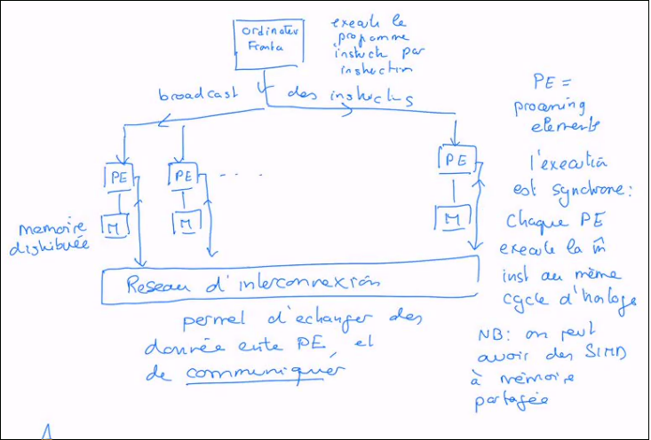

Paralellisme
============

[MPI](MPI)

examen 1/3 TP + 2/3 Oral
Oral: pas de préparation, liste de questions fournies

C'est quoi le parallélisme?

[TP](TP)

## 1.1 Concepts et définition
### **Def**: Le parallélisme c'est la résolution d'un `même problème` par la `coopération` de plusieurs processeurs.

Le but qu'on va explorer dans ce cours C'est le gain de performance que le parallélisme apporte.

Le parallélisme est naturel: on est habitué à collaborer. Les gens ont déjà pensés à faire ça pour les math et la physique.
Les premières machines avec des composants de calcul activables en même temps.

Si c'est naturel, c'est difficile à gérer (coordination à imposer)

À l'époque, le matériel n'était pas fiable et surtout un manque de modèle de calcul qui permet d'exploiter ces machines.

Problème résolut par l'architecture de von Neuman ("la machine séquentielle" par abus de langage).
Permet le développement des hardware et le développement des programmes car cela a donnée un modèle de calcul. Le parallélisme est mis de côté.
Les besoins de performances de calcul ne font qu'augmenter.

Les machine actuellement les plus puissantes offrent 200 [pflops](pflops)/s de puissance. Pour 2 gigawatt par machine (la puissance pour faire fonctionner 40 jet d'eau de Genève)

vers 1990 High performance computing ([HPC](HPC)) indique que le parallélisme est une méthode de performance.
Aujourd'hui si on a plus de 100 processeur, on peut parler de HPC.

### Limite de l'architecture de Von Neuman
* On peut accélérer la vitesse d'horloge de notre machine. Mais ça consomme plus d'énergie et produit beaucoup de chaleur.
* Memory Wall, Von Neuman (bottleneck= bouteille d'étranglement) 
	* ce qui vide la batterie est le transport des données du CPU à la mémoire (1000x plus gourmand que les calculs, en plus c'est lent de base)
	* roofline model:
		
	* Le plateau représente la puissance maximale. La pente montre que la bande passante est limitée.

### Historique du parallélisme
1. ILLIAC 1970 météo (qui est une machine qui faisait du parallélisme) (prévu avec 256 pro, mais construite avec 64 seulement, et pour 4x le prix)
2. Rapidement supplantée par les [machines_vectorielles](machines_vectorielles)
3. Dès les années 1990, réaparition des machines parallèle: SIMD, MIMD, SNP,... (plein de producteurs américains survivant aux subvention) On supplenté les [machines_vectorielles](machines_vectorielles)
4. Dans les années 2000, l'expantion des clusters -> démocratisation du parallélisme
5. Par la suite les GPU se sont aussi développer et imposés pour le HPC.
6. Cloud computing / GRID

Nouveau classement: GREEN COMPUTING (=voir le bon rapport puissances/consomation)

## 1.2 Où trouver des performances?
1. Améliorer la technologie (actuellement, on utilise du silicium comme semi-conducteur)
2. Améliorer l'architecture
3. Optimiser l'application

La fréquence max n'augmente plus depuis 2004
La miniaturisation permet de mettre plus de transistor dans une surface donnée. On est actuellement à 7 nanomètres, on annonce jusqu'à 3 nanomètres
	Limite: effet tunnel.
	

Exemple pour s'occuper des tartines:
Tâche:
	* couper le pain
	* beurrer les tranches
	* mettre la confiture
	* ranger sur un plat

Les stratégies:
1. sequentielle
2. travail à la chaine ou pipeline
3. SIMD (plusieurs font la même tâche en même temps)
4. MIMD (Multiple Instruction flow, multiple data flow)

Dans la 4e stratégie, les travailleurs vont réaliser leur tâche `à leur rythme`. Donc programmation asynchrone chacun travail sur ses propres données. On parle aussi de SPMD (Single Program, Multiple Data)

Mémoire distribué vs mémoire partagée. SIMD utilise une mémoire distribuée.

Parallélisme de contrôle (ou de tâche), où les travailleurs font en même temps des choses différente (exemple: pipeline), et le parallélisme de données où l'on fait la même chose sur des données différentes (SIMD, MIMD, SPMD)

Le parallélisme de données offre un potentiel beaucoup plus important que le parallélisme de contrôle. Ce dernier est limité à quelques tâches parallélisables par la limitation intrinsèque des problèmes à résoudre. Par contre il est fréquent de répéter la même opération sur des données énormes.

## Notion de granularité 
La taille des tâches associées à chaque processeur entre 2 échanges avec les autres processeurs.

## Scalabilité
Passage à l'échelle. C'est la possibilité d'augmenter le nombre de processeurs tout en augmentant les performances proportionnellement.

Il est très important pour les performances que tous les processeur soient toujours actifs et non qu'il s attendent le résultat d'un autre. Il faut donc distribuer le travail de façon équitable.
Par exemple si dans l'exempledes tartines, en MIMD, l'un des travailleurs ne faisait que couper le pain, il se pourrait que les autres doivent attendre. C'est un prolème difficiles du parallélisme qui sera rediscuté tou au long de ce cours.

Chapitre 2 Architectures à haute performance
=============================================

## 2.1 Différentes arhitectures

Architecture "instruction driven"

a		|single	| multiple
----------------------------------
single		|SISD	|MISD
multiple	| SIMD	|MIMD

C'est la classification de Flynn (~1970)

* Architecture vectorielle
* Architecture data-flow: C'est la disponibilité des données qui fait avancer le programme
* Architecture_ILP (Instruction Level parallelism)

## 2.2 Architecture SIMD

avantage:
Architecture simple et bien définie permettant une réalisation efficace.
Bien adapté à des problèmes réguliers qui sont nombreux en calcul scientifiques.

désavantage:
Organisation contraignante des calculs, manque de souplesse et inadaptés aux problèmes irréguliers.

Début historique du parallélisme de production mais maintenant réservé à des usages dédiés (accélérateur de calcul, GPU, Système embarqués)

Plus bas, un schéma d'un réseau systolique de cellule.

Multiplication matrice-vecteur:

## Conclusion:
Il y a deux type de parallelisme, mais plusieurs manières de le mettre en oeuvre. Le parallélisme de données où
beaucoup de valeurs différentes sont traitées en même temps par des processeurs
différents et le parallélisme de contrôle où des tâches différentes sont exécutées
simultanément. En pratique, on s’aperçoit que dans les codes scientifiques ou ceux
écrits par des ingénieurs, le parallélisme de données peut être très élevé (plusieurs
centaines ou milliers, voire bien davantage). Par contre, le parallélisme de contrôle
est bien moins important en général et dans la plupart des codes il ne dépasse
pas un facteur de 5 à 10.
Ces formes de parallélisme reflètent la nature du problème considéré alors que
la classification de Flynn décrit la nature de l’architecture utilisée pour traiter
le problème. Le parallélisme de donnée est bien adapté aux machines SIMD et
MIMD alors que le parallélisme de contrôle n’est possible que dans le cas MIMD.)

Granularité du parallélisme:
Niveau d'intervention du parallélisme dans un code/algorithme. Trois niveaux:
- jobs ou programmes
- tâches
- variables

## 2.5 Architectures data flow:
Ce n'est pas les instructions mais les données qui guident l'exécution des programmes. Très différent des models classiques (instruction-driven). Ainsi, dès que les opérandes sont disponibles instructions qui les modifient s'exécute. De plus l'ordre des opérations peut changer selon l'exécution. Deux types de data flow:

1. data-driven: C'est les données qui demande aux instructions de s'exécutés lorsqu'elles sont prêtes.
2. demand-driven: C'est les instructions qui demandant les donnée quand ils n'en trouvent pas.

Le data-flow est un avantage car il permet une exécution parallèle des instructions.

## 2.6 Parallélisme interne
Le Parallélisme est présent dans les processeurs (et même les coeurs) à petite échelle = Instruction level parallelsim. Granularité au niveau des instructions.
Exemple: le pipeline (avec fetch->decode->execute->write-back)
CPI: cycle per instruction

EU: Execution unit.
Pour le parallélisme utiliser
- le VLIW (very long instruction word) avec par exemple des instruction de 128 bits (4 instructions) à répartir dans chaque EU
- Superscalarité: utilise le model data-flow en utilisant des stations où les instructions viennent en attente. Les dépendances sont résolus en hardware

## branchement spéculatif
Casse un peu le pipe line d'exécution des instruction car on ne sait pas quelle est la procaine instruction à faire tant que le teste n'est pas fait. Donc casse un peut le parallélisme.
Même le calcule scientifique utilise 25% de branchement dans son code.

L'idée du branchement spéculatif est de déterminer arbitrairement la valeur du test et si erreur il y a, on retourne en arrière. Ce retour en arrière est coûteux mais peut être négliger s'il est rare. Ces suppositions sont la résultante d'étude qui montre certaine tendance de résultat par classe de teste (par exemple le tes "est plus grand que 0").

De cette façon, le flow d'instruction n'est pas interrompu par les branchements. On peut aussi avoir un test dynamique qui révise les prédictions selon les résultats des branchements.

# 3 Réseaux d'interconnexion

Le résexu d'interconnexion relie les processeurs entre eux et leur permet de communiquer et d'échanger des données. En général, l'échange processeur-processeur est plus lent que la communication processeur-mémoire interne.
Le réseau d'interconnexion doit être puissance et permettre à de nombreuses communications pour s'exécuter en même temps.

## 3.1 propriétés d'un réseau
2 types de réseau:
	- statique: topologie fixe un peu comme un graphe:
		- sommet: noeud de calcul
		- arc: câblage ou connexion
	- dynamique: un peu comme un switch dans lesquels tout les noeuds sont connecté (une connection en étoile)

propriétés d'un réseau:
Pour établir les performances:
	- Diamètre: la longueur la plus court liant deux noeuds.
	- Latence: le temps qu'il faut pour établir un contact entre 2 noeuds.
	- Bande passante: débit du réseau (quantité d'information par seconde)
	- Degré: nombre de lien qui viennent/partent d'un noeud
	- Largeur bissectionnelle: mesure la capacité d'un réseau à communiquer de façon globale
	- Prix (complexité): quantité de matériel pour réaliser ce réseau
	- Scalabilité: borne de la taille maximal du réseau

## Routage:
Algoirthme d'acheminement des messages (entre un processeur source et un processeur destination). On va alors exploiter la topoligie du réseau pour trouver le chemin le plus cours. Le routage est fait de façon asynchrone et de façon local (le message sait à chaque noeud où il doit aller)
On peut avoir un routage single-port ou multi-port selon qu'un noeud peut recevoir/envoyer plusieurs messages en même temps.
