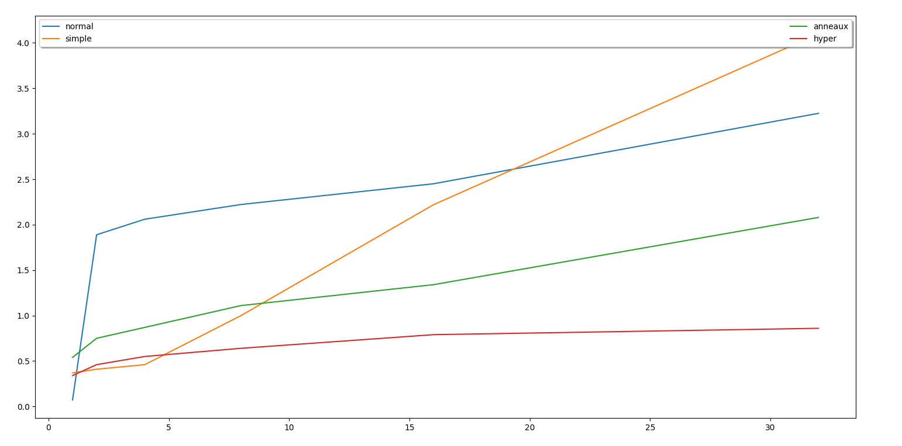

## **Hategekimana Fabrice**

BROADCAST
=========

## Graphique
Avec les résultats calculés sur baobab. Je tombe sur ça:  

On se rend facilement compte que l'algorithme de l'hypercube dépasse les autres en vitesse.

## Complexité

### algorithme simple
Comme le processus 0 envoie le vecteur a tout les processus. La complexité et un envoie de n-1 pour n processus donc ~O(n).

### algorithme anneau
Comme par cette méthode, l'envoie se fait en paralèlle (avec 2 envoie simultanés) la complexité est divisé par 2 ~O(n/2).
On peut généraliser cette méthode en augmentant le nombre d'envoie simultanés à m (chaque processus p envoie au processus p+m) ~O(n/m).

## algorithme hypercube
Au fur et a mesure que l'envoie progresse, le champ d'envoi est multiplié par 2 (comme l'expansion d'un arbre binaire) la complexité est donc de ~O(log_2(n))

