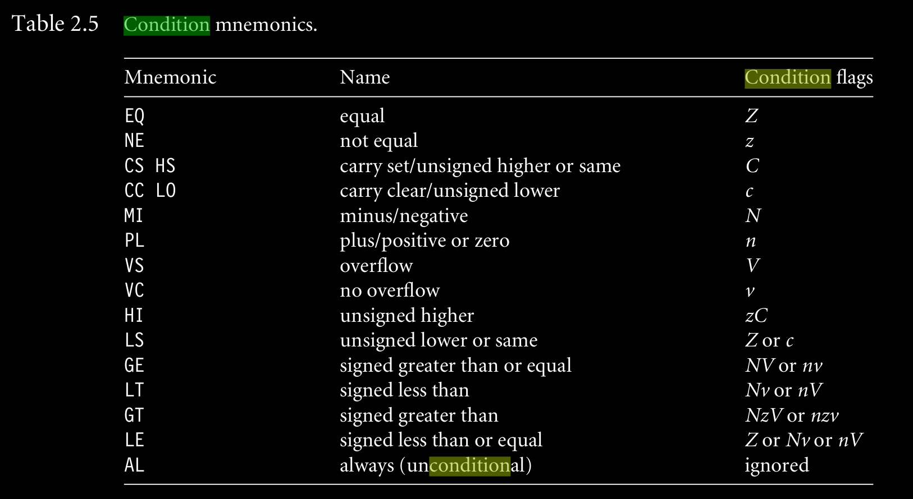

Conversion de valeur
====================

## condition mnemonic

## tp2 print char

les nombres peuvent être représenté comme hexadécimal:
char	0xCC
int	0xCCCC

%x--> prints un int en hexadecimal.

%4x--> prints un hex int, justifié à droite en 4 places. s'il y a moins de 4 digits, c'est précédé d'espaces. C'est plus de 4 digits on a le nombre entier.
%04x--> prints un hex int, justifié à droite en 4 places. s'il y a moins de 4 digits, c'est précédé de zéros. C'est plus de 4 digits on a le nombre entier mais sans zéro de poids fort.

en résumé:
le [0]nx indique sur combien de case doit être affiché le résultat. Si le résultat n'a pas assez de case, alors on complète par des zéros/espaces.

## Formatage
hexadécimal " %x "
décimal " %u "

## La pile
Mode d'adressage(3):
* pré index avec maj (= [base+décalage]!)
* pré index (= [base+décalage])
* post index (= [base])

**remarque**
La mise à jour se fait sur la base modifiée
+- peut préfixer l'offset et indique qu'il est signé

## Labo:
Utilisation porte logique
Comment utiliser les portes logiques pour les flags v, n, z

v= signed overflows (arrive si les opérande sont du même signe dans l'addition mais donne un résultat d'un signe contraire)
n= negative
z= 0
c= utile pour une addition et une soustraction lorsqu'il y a une retenue

si c=0 alors r0-r1= r0+(max-r1+1) <= max donc r0-r1<0 et finalement r0<r1

remarque: Connaitre les flags v, n, z

## Tableau
Il faut toujours un élément qui indique la taille du tableau

## .byte
Ne peux contenir que des nombres en hexadécimal (0xFF par exemple)
**Commandes utiles**:
ldrb => charge le byte dans le registre
ls => unsigned lower or same
cmp A B => A-B

