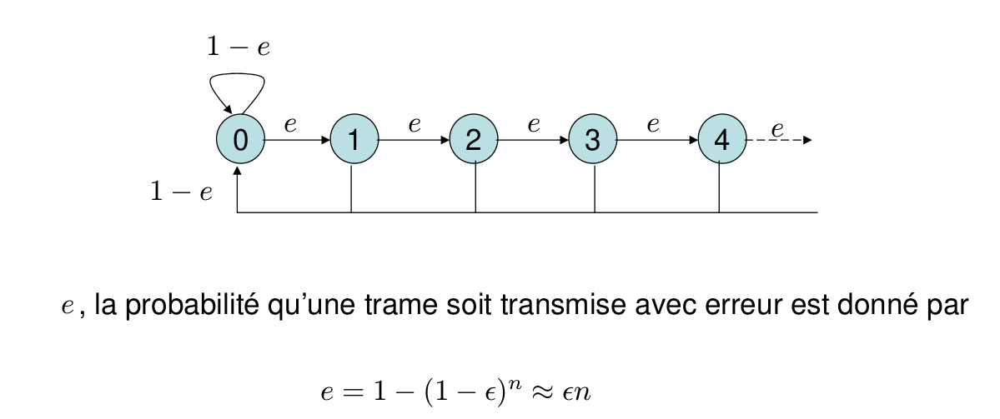

1. Stop_and_Wait
================

Algo:
On transmet une trame
On lance un temporisateur sur une duré (qui lève une interruption si le temps est dépassé)
Si acquittement positif
	Transmet la trame suivante
Sinon
	Redemande la même trame
	
On verra dans TCP comment gérer le temporisateur
Le temps d'acquittement est très variable selon les systèmes.

Comment améliorer?
-Avec Go_Back_N

## Modélisation:

Modélisation de l'emetteur:

Teste de performance (on compte le nombre de retransmission)

Algo:
etat= 0
while(true)
	if (random < e)
		etat++
	else
		etat= 0
	print etat
	
Chaine de Markov: discret
Processus de Markov: continue

