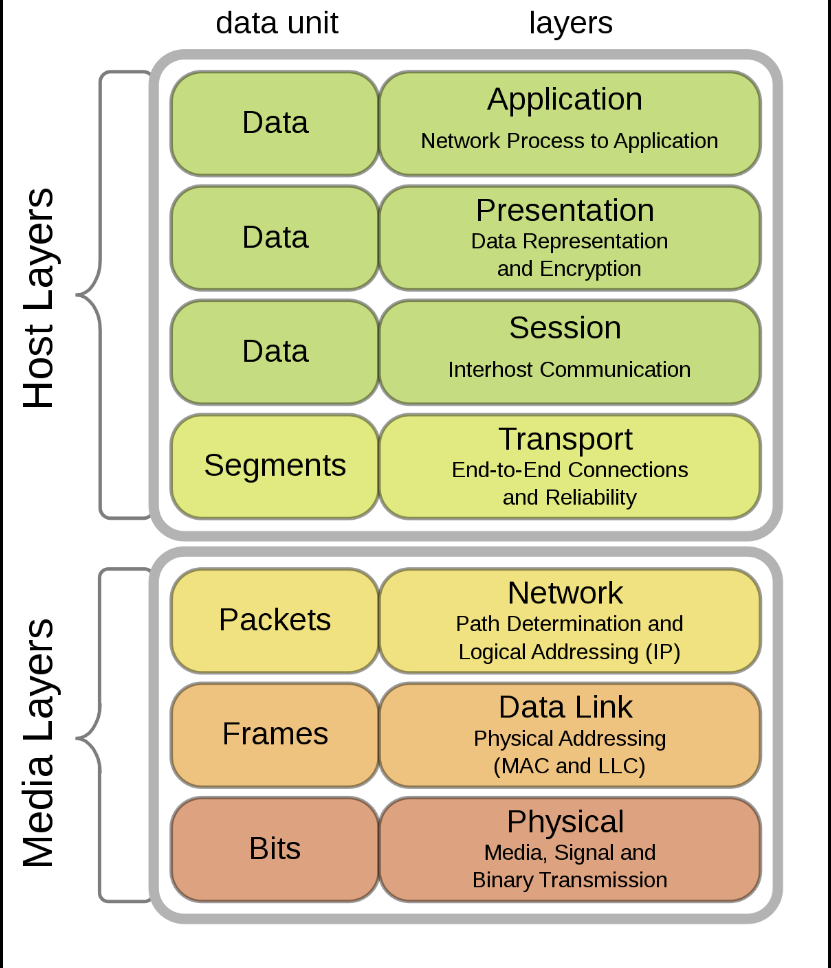

Réseaux informatiques
======================

[examen](examen)

## Utilité:
	* Partage de ressources
	* Réduction des coûts
	* Augmentation de performances
	* Disposer d'un média de connexion (réseaux sociaux par exemple)

Matériel informatique qu'on connecte ensemble

## Modèle ISO:
	On va s'intéresser aux différentes couches
	Il y a différents type de connexion (par ex connecter un frigo)
	Le modèle ISO permet de découper le problème
	Se ferra de bas en haut
	
## Couches Du modèle ISO:
0. Câble
1. [Hardware](Hardware)
2. [Linklayer](Linklayer) (fiabilise la liaison: s'assurer que l'info passe)
3. Network (faire du routage: trouver un chemin dans le réseaux, IPV6/IPV4)
4. Transport (fiabilise la connexion dans le réseaux, TCP/UDP)
5. Session ()
6. Présentation
7. Application

Cela permet une abstraction par couche (on ne s'intéresse à rien qui est en haut ou en bas)

## IEEE standards
Un groupe de personnes qui font des documents (RFC: request for comment).
IEEE 802.11= réseau wifi connecter par un BSS dans un Access Point (AP) et chaque station est connecté

## SSID
Server set ID: première sécurité, seules les stations qui partagent le même SSID peuvent communiquer ensemble

Hidden terminal problem: deux terminaux sont tellement éloignés qu'ils n'arrivent pas à voir quand l'autre parle (parler en même temps)
Pour résoudre ça, on utilise RTS (resolve to send) CTS (clear to send).
1. On lance le RTS, on attend le CTS et envoie les donnée, puis reçois un acquittement 

