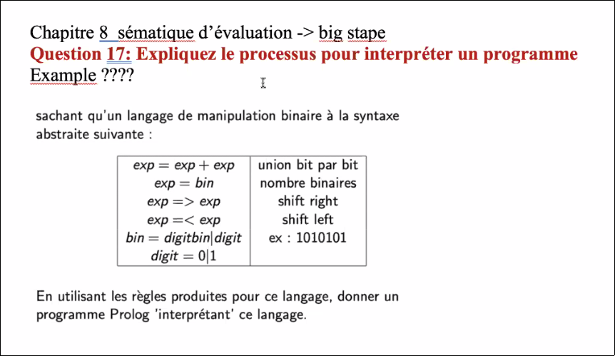

Question 17
===========

## Domaine sémantique et syntaxique
On commence par définir le domaine sémantique.
Le domaine concerne juste l'ensemble des nombre binaires B.
domaine syntaxique: T{+,<,>}(B)

## Règles sur les opérations shift
**pour le shift droit (cas de base)**  
\infer{>b::d=>_Bb}{}

**pour le shift gauche (cas de base)**  
\infer{<b=>_Bb::0}{}

**pour le shift droit (cas composé)**  
\infer{>e=>_Eb'}{e=>_Eb,>b=>_Bb'}

**pour le shift gauche (composé)**  
\infer{<e=>_Eb'}{e=>_Eb,<b=>_Bb'}

## Spécification Pour l'addition
**pour 0 0**  
\infer{e+e'=>d+d'}{e=>d, e'=>d', b+b'=>_B b''}

**pour 0 0**  
\infer{b+b' =>_B 0}{b=0, b'=0}

**pour 1 0**  
\infer{b+b' =>_B 0}{b=1, b'=0}

**pour 1 1**  
\infer{b+b' =>_B 1}{b=1, b'=1}

**pour 0 1**  
\infer{b+b' =>_B 1}{b=0, b'=1}
